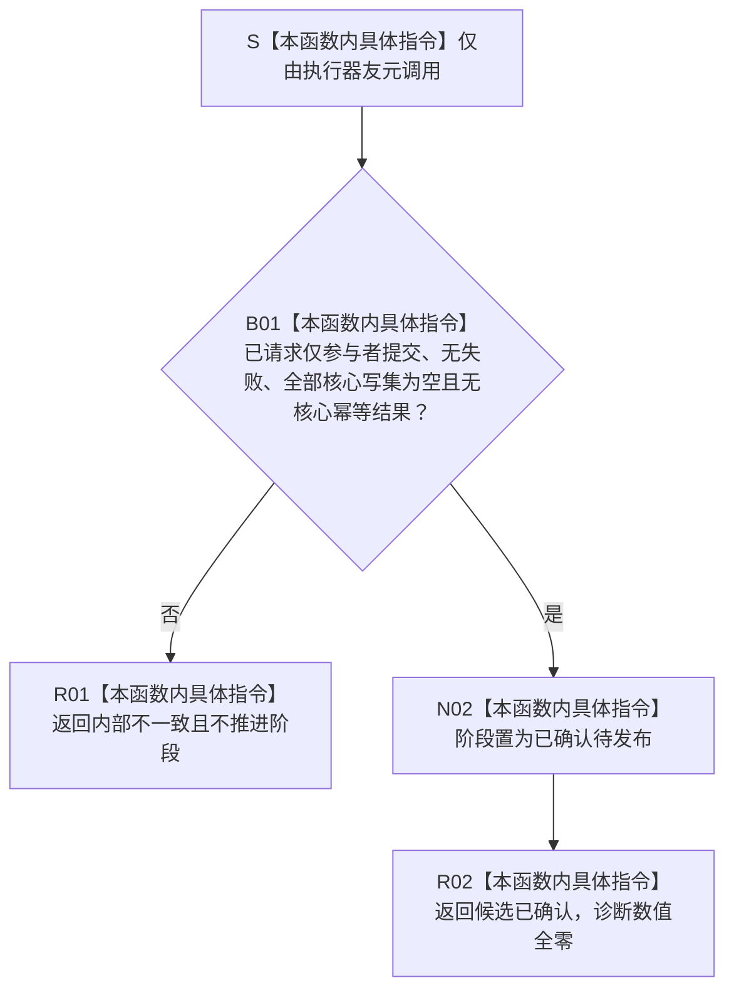

# SAFETY-P1-PROVIDER F-S111 完成仅参与者确认单函数施工流程图 v0.1

日期：2026-07-29

函数身份：F-S111

归属模块 / 文件：`海中鱼巣.核心.会话.节点直接身份结构写入` / `海中鱼巣/核心/会话.节点直接身份结构写入.ixx`

完整签名：

```cpp
节点直接身份结构写入结果
节点直接身份结构写入会话::完成仅参与者确认() noexcept;
```

返回结果：`节点直接身份结构写入结果`



本函数只确认空核心会话阶段，不确认参与者；参与者确认仍由 F-S109 按登记顺序完成。
