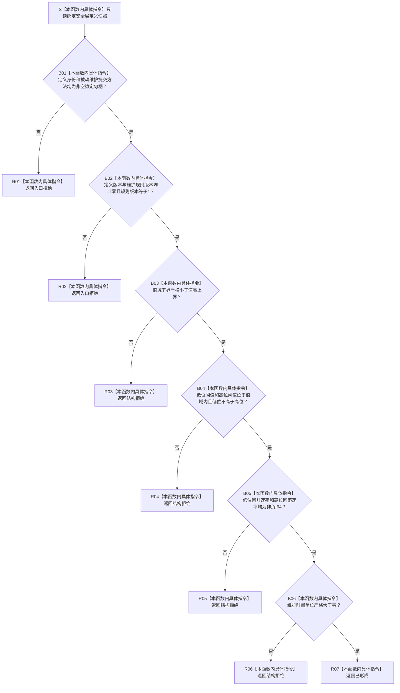

# SAFETY-P1 F-S101 `复核安全层定义` 单函数施工流程图 v0.1

图类型：目标施工流程图
状态：现行设计依据；函数待 #377 实现，不表示代码已存在
归属模块：`海中鱼巣.领域.算法.分层安全维护`
归属文件：`海中鱼巣/领域/算法.分层安全维护.ixx`
唯一根函数：F-S101
完整签名：

```cpp
安全结果分类 复核安全层定义(
    const 安全层定义快照& 定义) noexcept;
```

参数：`定义` 为调用期只读借用；函数不延长其生命周期，不保存引用。
返回：定义完整且数值、版本、阈值、速率与提交方法全部合法时返回 `安全结果分类::已形成`；入口身份或非零版本缺失返回 `入口拒绝`；数值范围、阈值顺序、速率或时间单位非法返回 `结构拒绝`；函数不产生载荷。
异常：不得越过 `noexcept`；本函数不分配内存，不读取仓库、时间或日志。
依据：6140 第 2、3、11、12 节；安全详细设计第 2、6、10、12、14 节。
验证：SP-A08、SP-A09、SP-A10，以及定义边界专项。

## 流程图



## 节点合同

| 节点 | 类型 | 输入 | 输出 | 事实读写 | 后继与验证 |
| --- | --- | --- | --- | --- | --- |
| S | 本函数内具体指令 | `定义` | 只读局部视图 | 零写入 | 进入身份准入 |
| B01—B02 | 本函数内具体指令 | 身份、方法、定义版本、规则版本 | 入口准入结论 | 零写入 | 非法走 R01/R02；覆盖空身份、零版本、未知规则版本 |
| B03—B06 | 本函数内具体指令 | 值域、阈值、速率、时间单位 | 结构准入结论 | 零写入 | 非法走 R03—R06；覆盖边界等号和负数 |
| R01—R07 | 本函数内具体指令 | 已裁决分类 | `安全结果分类` | 零写入 | 每条路径立即返回 |

## 实现约束

1. 检查顺序即复合错误优先级：身份/版本先于数值结构。
2. 不对非法值钳制，不用零、负数或默认句柄替代具名拒绝。
3. 本函数只验证定义，不读取当前值，也不决定维护方向。
