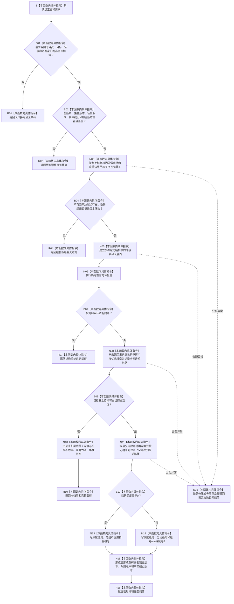

# SAFETY-P1 F-S102 `计算安全因果层级` 单函数施工流程图 v0.1

图类型：目标施工流程图
状态：现行设计依据；函数待 #377 实现，不表示代码已存在
归属模块：`海中鱼巣.领域.算法.安全因果层级`
归属文件：`海中鱼巣/领域/算法.安全因果层级.ixx`
唯一根函数：F-S102
完整签名：

```cpp
安全分层读取结果 计算安全因果层级(
    const 安全因果图快照& 图,
    const 安全分层读取请求& 请求) noexcept;
```

参数：两项均为调用期只读借用；函数只复制返回所需值式路径。
返回：完整一致图形成 `已形成` 或 `未归层` 载荷；入口身份非法为 `入口拒绝`；版本不一致为 `版本漂移`；坏端点、有环、重复稳定键或结构不闭合为 `结构拒绝`；分配失败为 `资源失败`。
异常：所有分配和容器异常在函数边界映射为 `资源失败`，不得越过 `noexcept`。
依据：6150 第 2—5、11、13、14 节；安全详细设计第 4、10、12、14 节。
验证：SP-A01—SP-A05。

## 流程图



## 节点合同

| 节点 | 类型 | 输入 | 输出 | 事实读写 | 后继与验证 |
| --- | --- | --- | --- | --- | --- |
| S—B02 | 本函数内具体指令 | 图、请求、版本 | 准入分类 | 零写入 | 身份先于版本；SP-A01 |
| N03—R07 | 本函数内具体指令 | 当前图节点与边 | 无环稳定邻接材料或结构拒绝 | 零写入 | 重复键、坏端点、自环、回边；SP-A01/A02 |
| N08—R10 | 本函数内具体指令 | 无环邻接表、来源与目标 | 未归层载荷或最短前驱 | 零写入 | 无路径不得降格坏图；SP-A03/A05 |
| N11—R15 | 本函数内具体指令 | 全部最短前驱 | 深度、主路径、并列路径、组 | 零写入 | D=0 不成组；D>=5 保留深度；SP-A03/A04 |
| E16 | 本函数内具体指令 | 分配/容器异常 | `资源失败`、无载荷 | 零写入 | 异常不得越界 |

## 实现约束

1. 广度优先层内按完整因果身份和稳定句柄排序；主路径与并列路径必须确定。
2. 版本值只做兼容与当前性门禁，不进入路径强弱或平局排序。
3. 无路径是合法 `未归层`；有环、坏端点和混合版本不得伪装成无路径。
