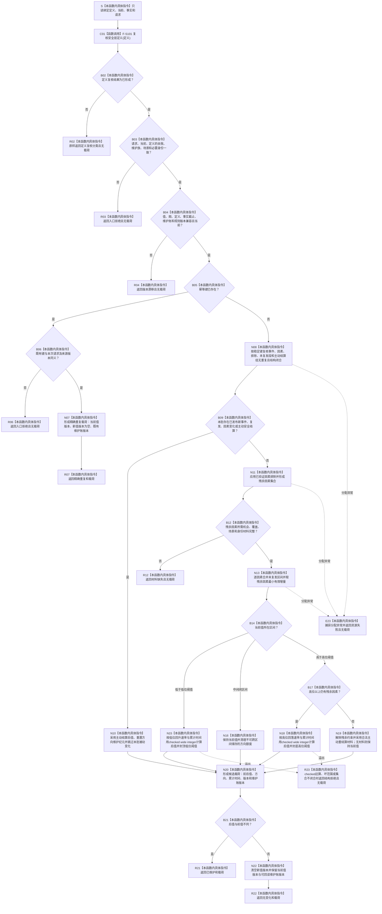

# SAFETY-P1 F-S103 `计算分层安全维护候选` 单函数施工流程图 v0.1

图类型：目标施工流程图
状态：现行设计依据；函数待 #377 实现，不表示代码已存在
归属模块：`海中鱼巣.领域.算法.分层安全维护`
归属文件：`海中鱼巣/领域/算法.分层安全维护.ixx`
唯一根函数：F-S103
完整签名：

```cpp
安全维护结果 计算分层安全维护候选(
    const 安全层定义快照& 定义,
    const 安全层当前快照& 当前,
    const 安全维护事实来源载荷& 事实,
    const 安全维护请求& 请求) noexcept;
```

参数：四项均为调用期只读借用；不保存引用，不读当前时间。
返回：实际值变化返回 `已维护`；合法无值变化返回 `无变化`；同幂等键同义重放返回 `精确重复`；身份非法为 `入口拒绝`；版本不闭合为 `版本漂移`；材料不足为 `材料缺失`；坏范围、坏证据、重复键、溢出为 `结构拒绝`；分配失败为 `资源失败`。成功类必须有载荷，其它分类无载荷。
依据：6140 第 2—9、11、12 节；安全详细设计第 5、6、9、10、12、14 节。
验证：SP-A06—SP-A11、SP-A19、SP-A20。

## 流程图



## 节点合同

| 节点 | 类型 | 输入 | 输出 | 事实读写 | 后继与验证 |
| --- | --- | --- | --- | --- | --- |
| C01 | 具名函数调用 | `定义` | `安全结果分类` | 零写入 | 唯一直接调用 F-S101 |
| B02—R07 | 本函数内具体指令 | 定义、身份、版本、幂等材料 | 入口/版本/重放分类 | 零写入 | SP-A07/A19 |
| N08—N13 | 本函数内具体指令 | 已发布事实副本 | 残余因素、有效时间、主动优先结论 | 零写入 | SP-A06/A07/A11 |
| B14—N20 | 本函数内具体指令 | 当前值、阈值、速率、时间 | 确定性维护候选 | 零写入 | SP-A08/A09/A10 |
| B21—R22 | 本函数内具体指令 | 前后值和候选版本 | 成功类载荷 | 零写入 | 新值版本只在实际变化出现 |
| E23/R23 | 本函数内具体指令 | 异常或坏结构 | 无载荷失败 | 零写入 | `noexcept` 边界 |

## 实现约束

1. 本函数只计算候选，不写仓库、状态、动态、因果、维护账或幂等账。
2. 主动安全事实只读消费；存在主动结算的受影响层本批不得再用旧累计时间抵消。
3. 时间只来自请求与已发布证据；循环次数、队列压力和无消息时间不得参与计算。
