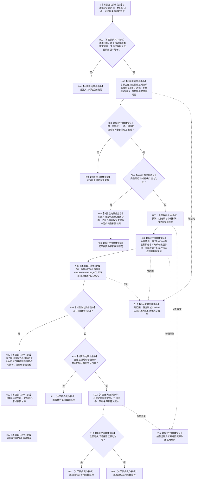

# SAFETY-P1 F-S104 `计算安全五组权限` 单函数施工流程图 v0.1

图类型：目标施工流程图
状态：现行设计依据；函数待 #377 实现，不表示代码已存在
归属模块：`海中鱼巣.领域.算法.安全任务权限`
归属文件：`海中鱼巣/领域/算法.安全任务权限.ixx`
唯一根函数：F-S104
完整签名：

```cpp
权限读取结果 计算安全五组权限(
    const std::vector<安全组层输入快照>& 有序层组,
    const std::vector<安全权限材料缺口>& 有序材料缺口组,
    const std::vector<安全权限层来源选择>& 有序未归层来源组,
    const 权限读取请求& 请求) noexcept;
```

参数：完整值式层输入、已知组具名缺口、未归层来源和请求只读借用；层组按组、来源需求、维护族、来源因果信息稳定排序，缺口按首个受影响组和缺口来源稳定排序，未归层组沿请求选择稳定序。
返回：完整材料形成 `已形成` 或 `权限为零` 完整载荷；组级材料缺口返回 `材料缺失` 部分载荷；入口身份非法为 `入口拒绝`；任一已使用版本漂移为 `版本漂移` 且无载荷；坏范围、重复键、溢出或守恒失败为 `结构拒绝`；分配失败为 `资源失败`。
依据：6150 第 5—7、11、13、14 节；安全详细设计第 7、10、12、14 节。
验证：SP-A04、SP-A13、SP-A14、SP-A17。

## 流程图



## 节点合同

| 节点 | 类型 | 输入 | 输出 | 事实读写 | 后继与验证 |
| --- | --- | --- | --- | --- | --- |
| S—N02 | 本函数内具体指令 | 请求、完整层、缺口、未归层三组 | 准入与精确分区材料 | 零写入 | D=0 不得进入层组、D>=5 保留深度；SP-A04 |
| B03—R04 | 本函数内具体指令 | 空完整层和空缺口 | 五组全零完整载荷 | 零写入 | 零适用层不得凭空发行满刻度；SP-A17 |
| N05—N06 | 本函数内具体指令 | 具名缺口、版本、V/L/H | 组释放倍率、输出层快照与限制来源 | 零写入 | 版本不入强弱；SP-A13/A14 |
| N07 | 本函数内具体指令 | 四门倍率 | 五组收到/保留权限 | 零写入 | checked wide integer；SP-A14 |
| B08—R10 | 本函数内具体指令 | 缺口组 | 部分载荷 | 零写入 | 低组保留、缺口组及高组为零 |
| B11—R14 | 本函数内具体指令 | 完整五组值 | 完整载荷或结构拒绝 | 零写入 | 守恒与零权限；SP-A14/A17 |
| E15/R15 | 本函数内具体指令 | 异常或坏结构 | 无载荷失败 | 零写入 | `noexcept` 边界 |

## 实现约束

1. 完整层和缺口均为空时五组全零并保留未归层来源；存在完整安全层后，空组不获赠权限，某组无任务不改变五组计算。
2. 材料缺失的零值不得伪称完整守恒；版本漂移不得降格为部分载荷。
3. 缺失层只能通过 `安全权限材料缺口` 输入，不得把零版本半结构塞入完整层组。
4. 三组输入必须与请求选择组形成精确分区；遗漏、重复或跨组同一选择属于结构拒绝。
5. 禁止浮点、绕回、钳制、`I64_MAX` 兜底或“第0组”。
