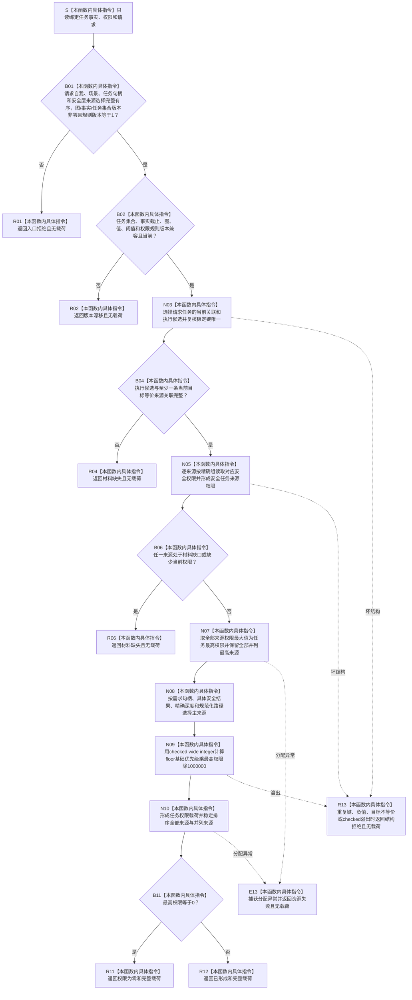

# SAFETY-P1 F-S105 `计算单任务安全权限` 单函数施工流程图 v0.1

图类型：目标施工流程图
状态：现行设计依据；函数待 #377 实现，不表示代码已存在
归属模块：`海中鱼巣.领域.算法.安全任务权限`
归属文件：`海中鱼巣/领域/算法.安全任务权限.ixx`
唯一根函数：F-S105
完整签名：

```cpp
任务权限结果 计算单任务安全权限(
    const 安全任务事实来源载荷& 任务事实,
    const 权限读取载荷& 权限,
    const 任务权限请求& 请求) noexcept;
```

参数：三项只读借用；不保存引用。
返回：至少一个完整当前来源时返回 `已形成` 或 `权限为零` 完整载荷；身份非法为 `入口拒绝`；版本漂移为 `版本漂移`；来源材料缺失为 `材料缺失`；重复稳定键、目标不等价、负值或 checked 溢出为 `结构拒绝`；分配失败为 `资源失败`。
依据：6150 第 8、9、11、13、14 节；安全详细设计第 8、10、12、14 节。
验证：SP-A15、SP-A17。

## 流程图



## 节点合同

| 节点 | 类型 | 输入 | 输出 | 事实读写 | 后继与验证 |
| --- | --- | --- | --- | --- | --- |
| S—B02 | 本函数内具体指令 | 请求自我、场景、任务、选择组与全部版本 | 入口/版本准入 | 零写入 | 版本只做门禁；不得从任务事实反推首次请求 |
| N03—R06 | 本函数内具体指令 | 任务候选、关联、组权限 | 完整来源组或材料缺失 | 零写入 | 目标等价、来源当前；SP-A15 |
| N07—N10 | 本函数内具体指令 | 全部合法来源权限、基础优先级 | 最高权限、主来源、有效优先级 | 零写入 | 取最高不求和；SP-A15 |
| B11—R12 | 本函数内具体指令 | 完整载荷 | 成功分类 | 零写入 | 零权限不删除任务；SP-A17 |
| E13/R13 | 本函数内具体指令 | 异常或坏结构 | 无载荷失败 | 零写入 | `noexcept` 边界 |

## 实现约束

1. 任务可以保留多个来源，但目标语义必须等价；不得合并为无来源汇总。
2. `权限为零` 只退出普通竞争，不改变任务、需求、筹办、材料或观察事实。
3. 任务有效执行优先级使用非负 I64 与 checked wide integer，不强行补 1。
