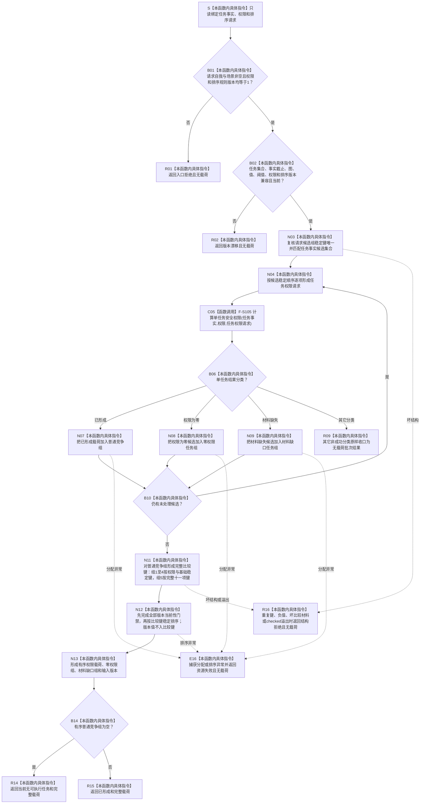

# SAFETY-P1 F-S106 `排序安全任务执行候选` 单函数施工流程图 v0.1

图类型：目标施工流程图
状态：现行设计依据；函数待 #377 实现，不表示代码已存在
归属模块：`海中鱼巣.领域.算法.安全任务权限`
归属文件：`海中鱼巣/领域/算法.安全任务权限.ixx`
唯一根函数：F-S106
完整签名：

```cpp
任务排序结果 排序安全任务执行候选(
    const 安全任务事实来源载荷& 任务事实,
    const 权限读取载荷& 权限,
    const 任务排序请求& 请求) noexcept;
```

参数：三项只读借用；函数形成独立值式结果，不保存引用。
返回：有普通竞争候选时返回 `已形成` 完整载荷；无可执行候选时返回 `当前无可执行任务` 完整载荷；入口非法为 `入口拒绝`；版本漂移为 `版本漂移`；材料缺失且不能形成完整批次为 `材料缺失`；重复键、负值、比较不闭合或溢出为 `结构拒绝`；分配失败为 `资源失败`。
依据：6150 第 8—11、13、14 节；安全详细设计第 8、10、12、14 节。
验证：SP-A15—SP-A17。

## 流程图



## 节点合同

| 节点 | 类型 | 输入 | 输出 | 事实读写 | 后继与验证 |
| --- | --- | --- | --- | --- | --- |
| S—N04 | 本函数内具体指令 | 请求、任务事实、权限 | 稳定候选遍历材料 | 零写入 | 重复任务句柄拒绝 |
| C05 | 具名函数调用 | 三个完整实参 | `任务权限结果` | 零写入 | 唯一直接调用 F-S105 |
| B06—B10 | 本函数内具体指令 | 单任务结果 | 三类候选分组或批次失败 | 零写入 | 零权限与材料缺口分账；SP-A17 |
| N11—N13 | 本函数内具体指令 | 普通竞争权限载荷和组5材料 | 确定有序载荷 | 零写入 | SP-A15/A16 |
| B14—R15 | 本函数内具体指令 | 完整分组结果 | 两种成功类载荷 | 零写入 | 空普通组为当前无可执行任务 |
| E16/R16 | 本函数内具体指令 | 异常或坏结构 | 无载荷失败 | 零写入 | `noexcept` 边界 |

## 组 5 比较键

版本门禁通过后，依次比较：

1. 任务最高权限降序；
2. 后果严重度降序；
3. 安全不足度降序；
4. 预计时间材料的适用性、完整性和预计剩余时间升序；
5. 当前反例数升序、有效基础正样本数降序；
6. 基础优先级降序；
7. 并列最高来源中的最小真实精确深度升序；
8. 规范化最短路径键升序；
9. 来源需求稳定句柄升序；
10. 任务创建序号升序；
11. 任务稳定句柄升序。

版本号只保留在 `安全输入版本快照`，不得进入强弱或平局键。
