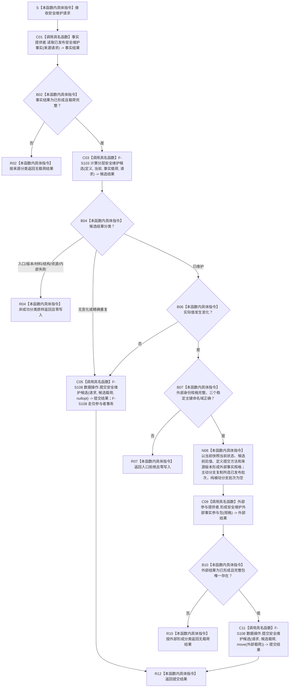

# SAFETY-P1 F-S107 评估并维护安全层单函数施工流程图 v0.1

日期：2026-07-29

函数身份：F-S107

归属模块 / 文件：`海中鱼巣.领域.服务.分层安全维护` / `海中鱼巣/领域/服务.分层安全维护.ixx`

完整签名：

```cpp
安全维护结果 分层安全维护服务::评估并维护安全层(
    const 安全维护请求& 请求);
```

返回结果：`安全维护结果`



## 节点合同

| 节点 | 类型 | 输入 / 输出 | 事实读写 | 验证 |
| --- | --- | --- | --- | --- |
| C01 | 被调函数 | 请求映射为来源请求；返回已发布值式事实 | 只读 | SP-A06/A07 |
| C03 | 被调函数 | 完整事实与请求进入 F-S103 | 零写入 | SP-A06—A11 |
| C05/C11 | 被调函数 | 无变化传空包并走仅参与者事务；变化传唯一 move-only 包并走核心会话事务 | 由 F-S108 统一提交 | SP-A12/A19 |
| B07/N08 | 本函数内具体指令 | 稳定主键分别绑定 `特征值身份`、`状态身份`、`动态身份`，并绑定前状态、可选已发布来源批次和版本 | 零写入；不得生成身份 | SP-A07/A11/A12 |
| C09 | 被调函数 | 完整输入规格形成外部事务包 | 只形成不可见候选包 | SP-A12 |
| R02/R04/R07/R10/R12 | 本函数内具体指令 | 强类型结果 | 失败零写入 | 结果载荷矩阵 |

本函数不得生成稳定主键、节点句柄、当前时间或默认来源批次。
