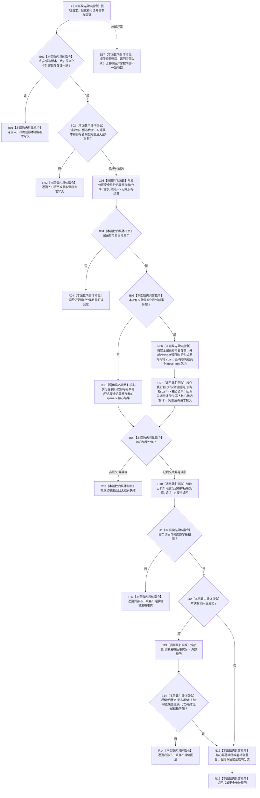

# SAFETY-P1 F-S108 提交安全维护候选单函数施工流程图 v0.1

日期：2026-07-29

函数身份：F-S108

归属模块 / 文件：`海中鱼巣.领域.数据操作.分层安全` / `海中鱼巣/领域/数据操作.分层安全.ixx`

完整签名：

```cpp
安全维护结果 分层安全数据操作::提交安全维护候选(
    const 安全维护请求& 请求,
    const 安全维护载荷& 候选,
    std::optional<安全维护外部事实参与载荷>&& 外部参与) noexcept;
```

返回结果：`安全维护结果`



## 节点合同

| 节点 | 类型 | 输入 / 输出 | 事务与生命周期 | 验证 |
| --- | --- | --- | --- | --- |
| B01/B02 | 本函数内具体指令 | 候选、包、代次、版本、span | 第一笔写前拒绝 | SP-A12/A19 |
| C03 | 被调函数 | 安全领域记录候选 | 返回独占参与者 | SP-A12 |
| B05 | 本函数内具体指令 | 实际变化必须有包；无变化/精确重复必须无包 | 第一笔写前选定唯一事务入口 | SP-A12/A19 |
| N06 | 本函数内具体指令 | 两个所有权包 -> 临时 span | span 不逃逸；包活到读回结束 | move-only 静态断言 |
| C07 | 被调函数 | 核心候选回调和参与者 span | 回调先形成节点/关系/索引候选，再统一准备/确认/发布；失败逆序撤销 | SP-A12 |
| C08 | 被调函数 | 只含安全记录参与者的非空 span | 消费 CORE-C1/v1，仅参与者事务零核心写集但仍统一确认、发布或撤销 | SP-A12/A19 |
| C10/C13 | 被调函数 | 安全记录与外部事实权威读回 | 仅在提交/幂等后读取 | SP-A12/A19 |
| B14 | 本函数内具体指令 | 三个请求稳定主键与三个已发布句柄、值、来源批次、代次和版本 | 不接受半结构 | SP-A12 |
| R11/R14 | 本函数内具体指令 | 发布后不一致 | 内部错误，不重新撤销 | SP-A12 |

外部包内部的参与者可以借用包内候选身份材料；包和记录参与者必须覆盖核心执行、最后发布及两路发布后读回的完整生命周期。
