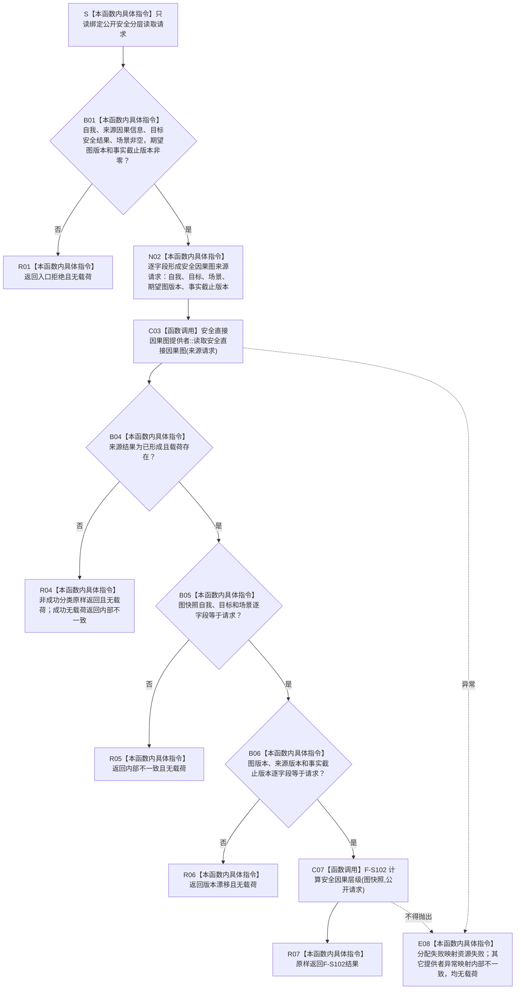

# SAFETY-P1 F-S112 `读取安全因果分层` 单函数施工流程图 v0.1

日期：2026-07-29

图类型：目标施工流程图

状态：现行设计依据；函数待 #377 实现，不表示代码已存在

函数身份：F-S112

归属模块 / 文件：`海中鱼巣.领域.服务.安全因果分层` / `海中鱼巣/领域/服务.安全因果分层.ixx`

完整签名：

```cpp
安全分层读取结果 安全因果分层服务::读取安全因果分层(
    const 安全分层读取请求& 请求) const;
```

参数：请求只读借用；服务不保存引用。

返回：图来源成功时调用 F-S102 并原样返回纯值结果；入口非法、版本漂移、结构拒绝、资源失败和内部不一致均无载荷。

依据：6150 第 2—5、11、13、14 节；安全详细设计第 10.1、10.2、10.4 节。

验证：SP-A01—SP-A05 的服务来源形成与回显分支。

## 流程图



## 节点合同

| 节点 | 类型 | 输入 | 输出 | 事实读写 | 后继与验证 |
| --- | --- | --- | --- | --- | --- |
| S—N02 | 本函数内具体指令 | 公开请求 | 完整来源请求或入口拒绝 | 零写入 | 禁止零版本和读取最新 |
| C03 | 具名函数调用 | 完整来源请求 | `安全因果图来源结果` | 只读提供者 | 调用一次，不枚举仓库 |
| B04—B06 | 本函数内具体指令 | 来源结果、图回显 | 完整当前图或结构化失败 | 零写入 | 身份不等为内部不一致，版本不等为版本漂移 |
| C07—R07 | 具名函数调用 + 本函数内具体指令 | 图快照、原公开请求 | `安全分层读取结果` | 零写入 | F-S102 唯一算法入口 |
| E08 | 本函数内具体指令 | 调用异常 | 无载荷失败 | 零写入 | 不返回半图 |

## 实现约束

1. 服务不得生成图版本、改变目标安全结果或从图载荷反推首次请求。
2. 提供者成功无载荷属于内部不一致；不得伪装成未归层。
3. `未归层` 只能由 F-S102 在完整合法图上形成。
