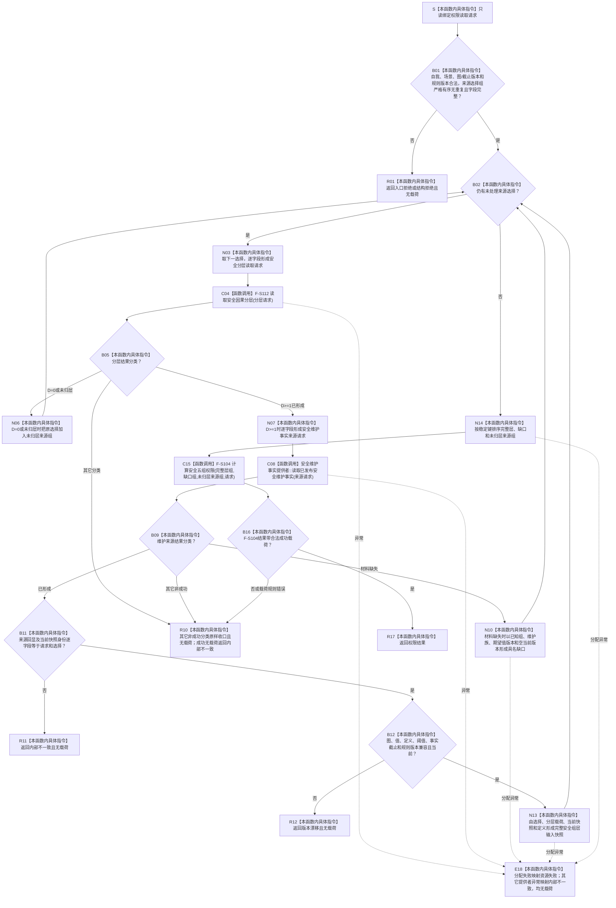

# SAFETY-P1 F-S113 `读取安全权限快照` 单函数施工流程图 v0.1

日期：2026-07-29

图类型：目标施工流程图

状态：现行设计依据；函数待 #377 实现，不表示代码已存在

函数身份：F-S113

归属模块 / 文件：`海中鱼巣.领域.服务.安全任务权限` / `海中鱼巣/领域/服务.安全任务权限.ixx`

完整签名：

```cpp
权限读取结果 安全任务权限服务::读取安全权限快照(
    const 权限读取请求& 请求) const;
```

参数：请求只读借用；服务形成独立值式输入组，不保存引用。

返回：完整层形成 `已形成` 或 `权限为零`；已知组缺口形成带部分载荷的 `材料缺失`；空选择组或全部未归层形成五组全零 `权限为零` 并保留未归层来源；其它分类无载荷。

依据：6150 第 5—7、11.1、13、14 节；安全详细设计第 10.1、10.2、10.4 节。

验证：SP-A04、SP-A13、SP-A14、SP-A17。

## 流程图



## 节点合同

| 节点 | 类型 | 输入 | 输出 | 事实读写 | 后继与验证 |
| --- | --- | --- | --- | --- | --- |
| S—B01 | 本函数内具体指令 | 权限请求 | 合法稳定选择组 | 零写入 | 四元身份重复或异版为结构拒绝 |
| N03—C04 | 本函数内具体指令 + 具名函数调用 | 一个选择项 | 分层结果 | 只读因果服务 | 最终安全结果、图和截止版本只从请求形成 |
| B05—N06 | 本函数内具体指令 | 分层结果 | 未归层来源组 | 零写入 | D=0/无路径不读取维护事实 |
| N07—C08 | 本函数内具体指令 + 具名函数调用 | D>=1选择 | 维护事实结果 | 只读维护提供者 | 维护族和期望值版本显式 |
| B09—N10 | 本函数内具体指令 | 已知组来源失败 | 具名缺口或批次失败 | 零写入 | 不用零版本半结构 |
| B11—N13 | 本函数内具体指令 | 来源回显、当前快照、定义、分层 | 完整层输入 | 零写入 | 身份不等和版本不等分账 |
| N14—C15 | 本函数内具体指令 + 具名函数调用 | 三个稳定组 | 权限结果 | 零写入 | F-S104 唯一权限算法 |
| B16—R17 | 本函数内具体指令 | F-S104 权限结果 | 完整返回 | 零写入 | 成功载荷规则和未归层审计已由 F-S104 闭合 |
| E18 | 本函数内具体指令 | 调用 / 分配异常 | 无载荷失败 | 零写入 | 不返回半权限 |

## 实现约束

1. 服务不得枚举维护族、读取“最新值”或从返回载荷补造首次请求字段。
2. 选择组为空时不得调用维护事实提供者；F-S104 必须形成五组全零完整载荷。
3. `安全组层输入快照` 不含释放倍率；释放倍率只由 F-S104 计算。
4. 同一维护族可被不同来源需求引用，但四元选择身份必须唯一。
