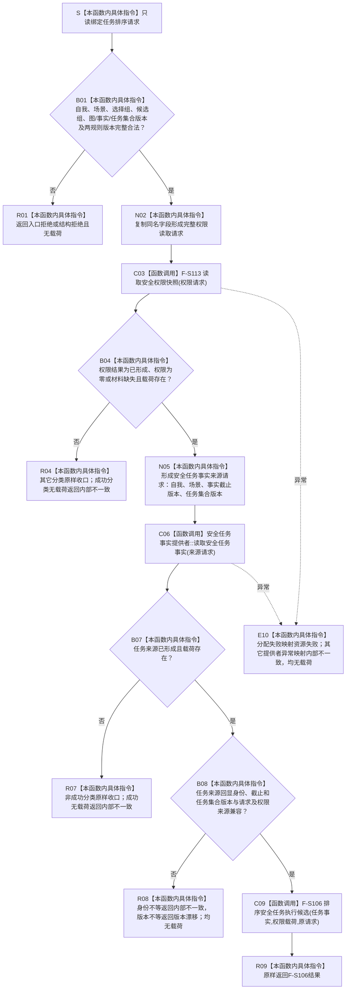

# SAFETY-P1 F-S115 `排序任务执行候选` 单函数施工流程图 v0.1

日期：2026-07-29

图类型：目标施工流程图

状态：现行设计依据；函数待 #377 实现，不表示代码已存在

函数身份：F-S115

归属模块 / 文件：`海中鱼巣.领域.服务.安全任务权限` / `海中鱼巣/领域/服务.安全任务权限.ixx`

完整签名：

```cpp
任务排序结果 安全任务权限服务::排序任务执行候选(
    const 任务排序请求& 请求) const;
```

参数：请求只读借用；服务不保存引用。

返回：双来源成功后调用 F-S106；无普通竞争候选由 F-S106 返回 `当前无可执行任务` 完整载荷；其它失败无半载荷。

依据：6150 第 8—11.1、13、14 节；安全详细设计第 10.1、10.2、10.4 节。

验证：SP-A15—SP-A17 的服务来源形成、单次快照和排序编排。

## 流程图



## 节点合同

| 节点 | 类型 | 输入 | 输出 | 事实读写 | 后继与验证 |
| --- | --- | --- | --- | --- | --- |
| S—N02 | 本函数内具体指令 | 排序公开请求 | 完整权限请求 | 零写入 | 候选稳定键重复为结构拒绝 |
| C03—B04 | 具名函数调用 + 本函数内具体指令 | 权限请求 | 可消费权限载荷 | 只读权限服务 | 三类带载荷结果允许继续 |
| N05—C06 | 本函数内具体指令 + 具名函数调用 | 自我、场景、截止、任务集合版本 | 任务事实结果 | 只读任务提供者 | 来源读取一次 |
| B07—B08 | 本函数内具体指令 | 来源回显、权限来源版本 | 同一快照任务事实 | 零写入 | 身份 / 版本分账 |
| C09—R09 | 具名函数调用 + 本函数内具体指令 | 任务事实、权限、原请求 | `任务排序结果` | 零写入 | F-S106 唯一排序算法 |
| E10 | 本函数内具体指令 | 调用 / 分配异常 | 无载荷失败 | 零写入 | 不返回半排序 |

## 实现约束

1. 服务不得逐任务重读权限或任务仓；一个请求只消费一份权限快照和一份任务事实快照。
2. 候选组和任务集合版本均由公开请求冻结；任务提供者不得改变候选集合。
3. 版本只做当前性门禁，不进入排序比较键。
