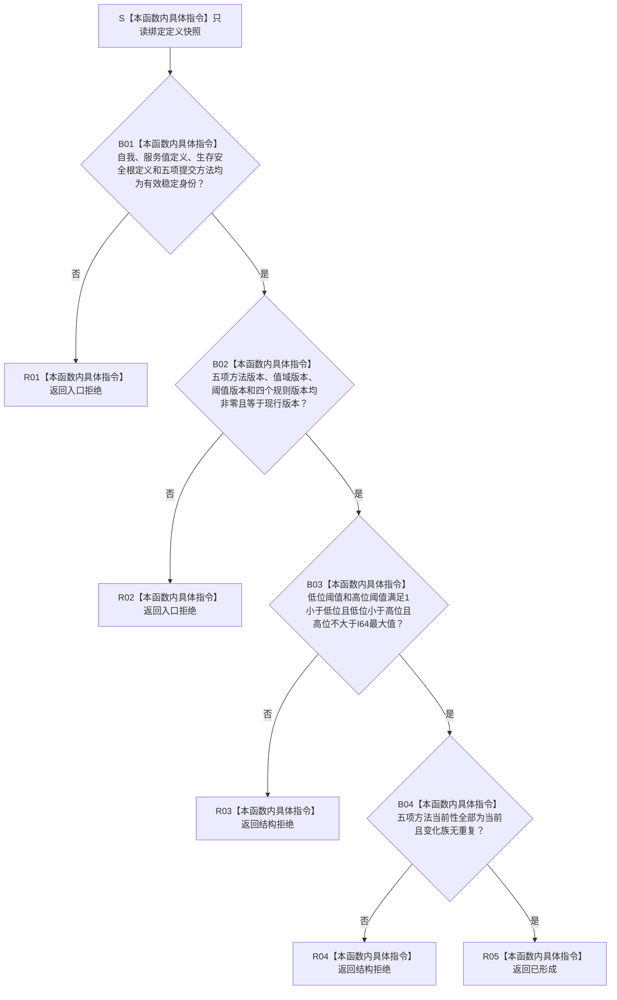

# SERVICE-P1 F-V201 `复核服务生存定义` 单函数施工流程图 v0.1

图类型：目标施工流程图
状态：现行设计依据；函数待 #379 实现，不表示代码已存在
归属模块：`海中鱼巣.领域.算法.服务值时间维护`
归属文件：`海中鱼巣/领域/算法.服务值时间维护.ixx`
唯一根函数：F-V201
完整签名：

```cpp
服务生存结果分类 复核服务生存定义(
    const 服务生存定义快照& 定义) noexcept;
```

参数只读借用；返回 `已形成`、`入口拒绝` 或 `结构拒绝`，不产生载荷。依据 6160、6170 与服务详细设计第 4—5、9 节。验证映射 SS-A03、A14—A17、A19。

## 流程图



## 节点合同

| 节点 | 输入 | 输出 | 事实读写 | 验证 |
| --- | --- | --- | --- | --- |
| S—B02 | 定义身份、方法、版本 | 入口准入 | 零写入 | 空身份、零/未知版本 |
| B03—B04 | 阈值和方法当前性 | 结构准入 | 零写入 | 阈值边界、重复族、失效方法 |
| R01—R05 | 已裁决分类 | 枚举结果 | 零写入 | 全返回路径 |

实现不得读取仓库、时间、日志或生成身份，不得钳制非法阈值。
