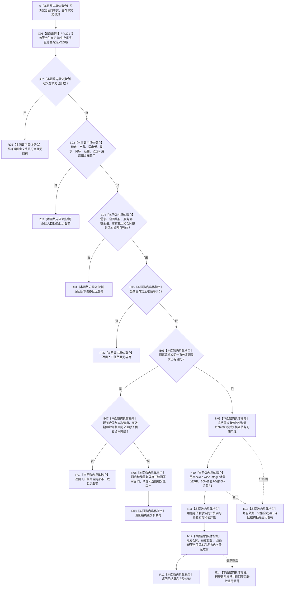

# SERVICE-P1 F-V202 `计算服务合同建立候选` 单函数施工流程图 v0.1

图类型：目标施工流程图
状态：现行设计依据；函数待 #379 实现，不表示代码已存在
归属模块：`海中鱼巣.领域.算法.服务合同结算`
归属文件：`海中鱼巣/领域/算法.服务合同结算.ixx`
唯一根函数：F-V202
完整签名：

```cpp
服务合同结果 计算服务合同建立候选(
    const 服务合同事实来源载荷& 合同事实,
    const 服务生存事实来源载荷& 生存事实,
    const 服务合同建立请求& 请求) noexcept;
```

返回新合同 `已结算`、同义重放 `精确重复`，或无载荷拒绝。函数只形成值式候选，不生成稳定身份、不提交事务。依据 6160 全部合同阶段与服务详细设计第 4—7、9 节。验证映射 SS-A01—A07。

## 流程图



## 节点合同

| 节点 | 类型 | 输出 | 验证 |
| --- | --- | --- | --- |
| C01 | 函数调用 | 定义分类 | F-V201 唯一调用 |
| B03—R08 | 本函数内具体指令 | 入口/版本/终止/幂等裁决 | SS-A01—A03 |
| N09—N12 | 本函数内具体指令 | 合同和30%预支候选 | SS-A03—A07 |
| R13/E14 | 本函数内具体指令 | 无载荷失败 | 溢出与资源失败 |

合同与预支必须作为同一候选；不得出现可读的“合同已建立但预支未发布”状态。
