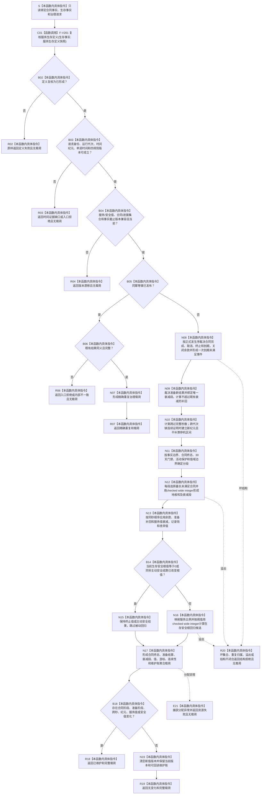

# SERVICE-P1 F-V203 `计算服务生存治理候选` 单函数施工流程图 v0.1

图类型：目标施工流程图
状态：现行设计依据；函数待 #379 实现，不表示代码已存在
归属模块：`海中鱼巣.领域.算法.服务值时间维护`
归属文件：`海中鱼巣/领域/算法.服务值时间维护.ixx`
唯一根函数：F-V203
完整签名：

```cpp
服务生存治理结果 计算服务生存治理候选(
    const 服务合同事实来源载荷& 合同事实,
    const 服务生存事实来源载荷& 生存事实,
    const 服务生存治理请求& 请求) noexcept;
```

返回 `已维护`、`无变化`、`精确重复` 完整载荷，或冻结的无载荷拒绝。只形成同秒聚合候选，不提交事务。依据 6160、6170 与服务详细设计第 4—7、9—11 节。验证映射 SS-A05—A16、A19—A22。

## 流程图



## 节点合同

| 节点 | 输出 | 验证 |
| --- | --- | --- |
| C01—R07 | 定义、入口、时间、版本和幂等准入 | SS-A09、A19、A20 |
| N08—N09 | 合同终态、到期事件和准备补回候选 | SS-A05—A08 |
| N10—N13 | 时间分段、衰减段和服务值候选 | SS-A09—A13 |
| B14—N16 | 终止/主动安全优先和根回归候选 | SS-A14—A16、A21—A22 |
| N17—R19 | 聚合成功载荷 | SS-A19—A20 |

合同终态、准备补回、完整秒衰减和根回归必须在一个值式聚合候选中，不得拆成公开写入口。
