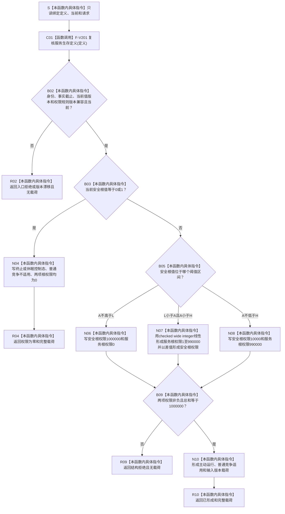

# SERVICE-P1 F-V204 `计算安全服务根权限` 单函数施工流程图 v0.1

图类型：目标施工流程图
状态：现行设计依据；函数待 #379 实现，不表示代码已存在
归属模块：`海中鱼巣.领域.算法.服务生存任务权限`
归属文件：`海中鱼巣/领域/算法.服务生存任务权限.ixx`
唯一根函数：F-V204
完整签名：

```cpp
安全服务根权限结果 计算安全服务根权限(
    const 服务生存定义快照& 定义,
    const 服务生存当前快照& 当前,
    const 安全服务根权限请求& 请求) noexcept;
```

返回 `已形成`、`权限为零` 完整载荷或无载荷拒绝。依据 6170 第 8—10 节与服务详细设计第 5、9.4 节。验证映射 SS-A15、A17。

## 流程图



版本只做门禁；A=0/1 不进入普通任务竞争；A>1 时两项根权限严格守恒。
