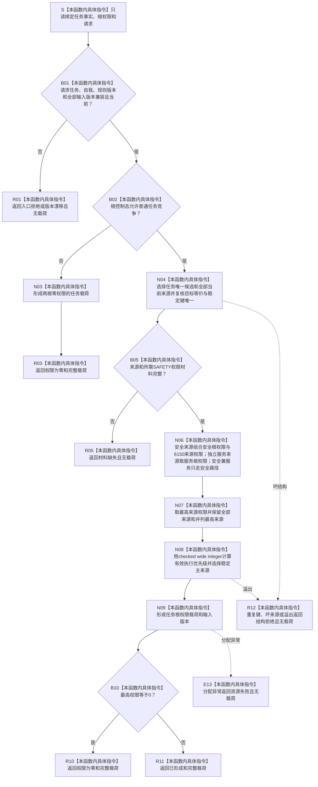

# SERVICE-P1 F-V205 `计算单任务根权限` 单函数施工流程图 v0.1

图类型：目标施工流程图
状态：现行设计依据；函数待 #379 实现，不表示代码已存在
归属模块：`海中鱼巣.领域.算法.服务生存任务权限`
归属文件：`海中鱼巣/领域/算法.服务生存任务权限.ixx`
唯一根函数：F-V205
完整签名：

```cpp
任务根权限结果 计算单任务根权限(
    const 服务任务事实来源载荷& 任务事实,
    const 安全服务根权限载荷& 根权限,
    const 任务根权限请求& 请求) noexcept;
```

返回 `已形成` 或 `权限为零` 完整载荷；材料、版本、结构和资源失败无载荷。依据 6170 第 10—11 节、6150 当前权限合同和服务详细设计第 5.3、9.4 节。验证映射 SS-A17—A18。

## 流程图



安全兼服务来源不得重复取得服务权限；多来源取最高而不求和；零权限不删除任务或事实。
