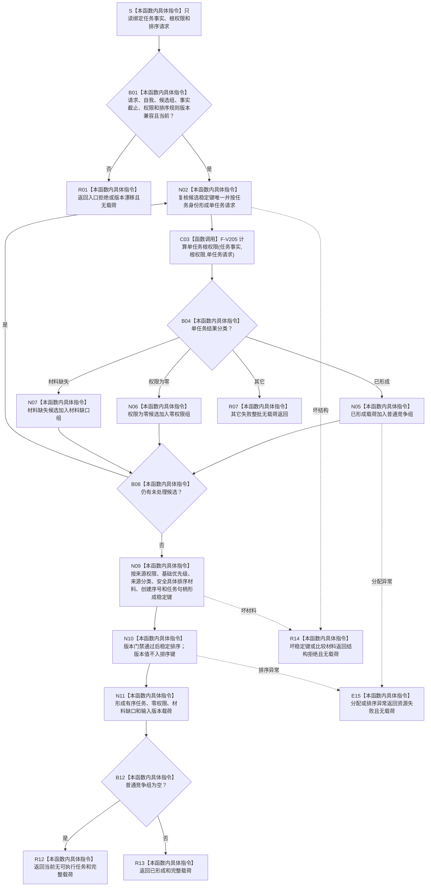

# SERVICE-P1 F-V206 `排序服务生存任务执行候选` 单函数施工流程图 v0.1

图类型：目标施工流程图
状态：现行设计依据；函数待 #379 实现，不表示代码已存在
归属模块：`海中鱼巣.领域.算法.服务生存任务权限`
归属文件：`海中鱼巣/领域/算法.服务生存任务权限.ixx`
唯一根函数：F-V206
完整签名：

```cpp
服务生存任务排序结果 排序服务生存任务执行候选(
    const 服务任务事实来源载荷& 任务事实,
    const 安全服务根权限载荷& 根权限,
    const 服务生存任务排序请求& 请求) noexcept;
```

遍历候选调用 F-V205，分账普通竞争、零权限和材料缺口，并稳定排序。依据 6170 第 10—11 节与服务详细设计第 5.3、9.4 节。验证映射 SS-A17—A18、A22。

## 流程图



候选顺序只影响遍历，不得影响最终稳定结果；A=0/1 时普通组必为空但零权限任务仍保留。
