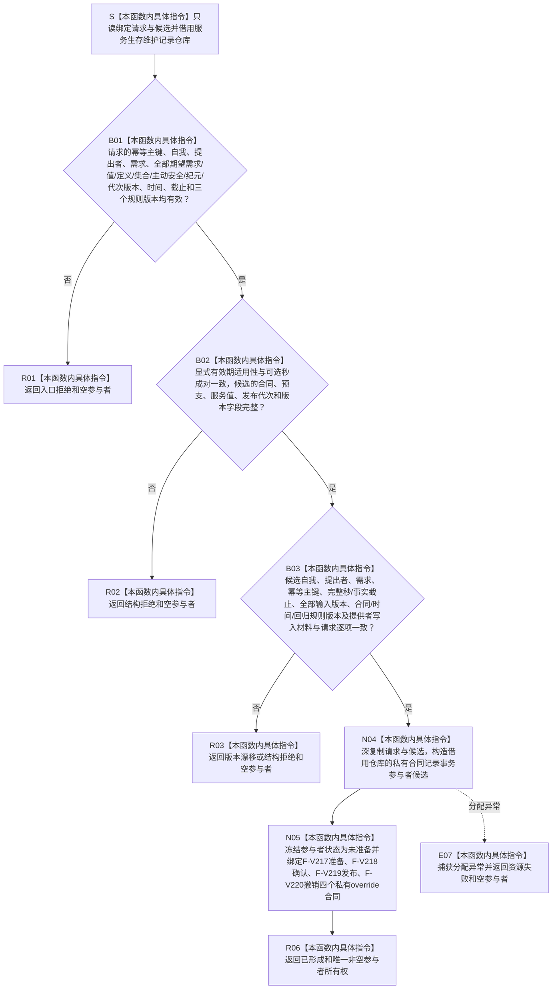

# SERVICE-P1 F-V207 `形成服务合同记录参与者` 单函数施工流程图 v0.1

图类型：目标施工流程图
状态：现行设计依据；函数待 #379 实现，不表示代码已存在
归属模块：`海中鱼巣.领域.参与者.服务生存维护记录`
归属文件：`海中鱼巣/领域/参与者.服务生存维护记录.ixx`
唯一根函数：F-V207
完整签名：

```cpp
服务生存记录参与结果 形成服务合同记录参与者(
    服务生存维护记录仓库& 仓库,
    const 服务合同建立请求& 请求,
    const 服务合同载荷& 候选) noexcept;
```

`仓库` 为覆盖参与者全生命周期的借用；`请求`、`候选` 在本函数内复核并复制进私有参与者候选，不保存其引用。仅 `已形成` 返回非空 move-only 参与者，其它分类必须返回空指针。依据 0050、6160 与服务详细设计 v0.3 第 6、7.4、8、10 节。

## 流程图



## 节点合同

| 节点 | 类型 | 输入 | 输出 | 事实读写 |
| --- | --- | --- | --- | --- |
| S—B03 | 本函数内具体指令 | 公开请求、合同候选 | 入口、结构、版本裁决 | 零写入 |
| N04—N05 | 本函数内具体指令 | 已复核值式副本、借用仓库 | move-only 私有参与者 | 仅形成未发布内存候选 |
| R01—R06/E07 | 本函数内具体指令 | 已裁决分类 | 参与结果 | 失败零可读结构 |

## 实现约束

1. 参与者保存仓库借用与请求/候选值式副本，不得保存调用方引用、原始指针视图、锁或执行许可。
2. 精确同键同义由参与者准备阶段返回幂等读回；同键异义、异版或已发布半结构不得改写为新候选。
3. 参与者内部锁只由执行器回调期取得；不得在本工厂中提前持锁，不得调用上层服务、日志或外部提供者。
4. 未确认候选始终不可由 F-V209 普通读取看见；确认前失败必须可逆序撤销，发布后不得伪撤销。
