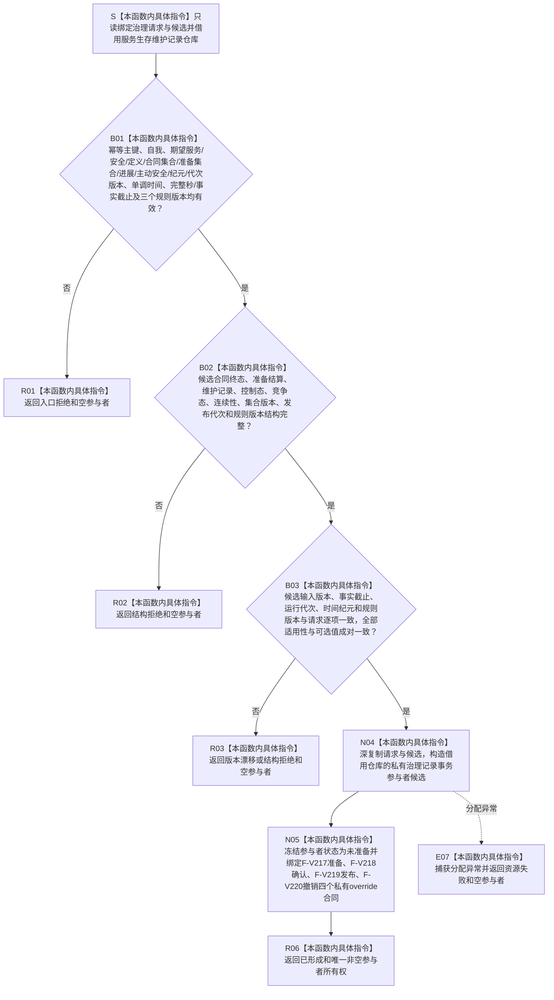

# SERVICE-P1 F-V208 `形成服务生存治理记录参与者` 单函数施工流程图 v0.1

图类型：目标施工流程图
状态：现行设计依据；函数待 #379 实现，不表示代码已存在
归属模块：`海中鱼巣.领域.参与者.服务生存维护记录`
归属文件：`海中鱼巣/领域/参与者.服务生存维护记录.ixx`
唯一根函数：F-V208
完整签名：

```cpp
服务生存记录参与结果 形成服务生存治理记录参与者(
    服务生存维护记录仓库& 仓库,
    const 服务生存治理请求& 请求,
    const 服务生存治理载荷& 候选) noexcept;
```

`仓库` 为覆盖参与者全生命周期的借用；请求和候选复制进私有参与者。无变化、精确重复和发生实际变化都必须形成一个服务记录参与者，保证 F-V212 的仅参与者事务组非空。依据 0050、6160、6170 与服务详细设计 v0.3 第 6、7.4、8、10 节。

## 流程图



## 节点合同

| 节点 | 类型 | 输入 | 输出 | 事实读写 |
| --- | --- | --- | --- | --- |
| S—B03 | 本函数内具体指令 | 治理请求、治理候选 | 入口、结构、版本裁决 | 零写入 |
| N04—N05 | 本函数内具体指令 | 已复核值式副本、借用仓库 | move-only 私有参与者 | 仅形成未发布内存候选 |
| R01—R06/E07 | 本函数内具体指令 | 已裁决分类 | 参与结果 | 失败零可读结构 |

## 实现约束

1. 无变化也必须冻结维护账、事实截止和当前版本读回，不得用空参与者表示无变化。
2. 精确同键同义由参与者准备阶段返回幂等读回；同键异义、时间纪元冲突、集合版本漂移或半结构属于拒绝/内部不一致。
3. 参与者只在执行器回调期间按冻结锁序操作仓库；不得持锁调用服务、提供者、日志或 F-V210。
4. 新值版本只在对应值实际变化时存在；无变化/精确重复不得制造服务值或安全值新版本。
