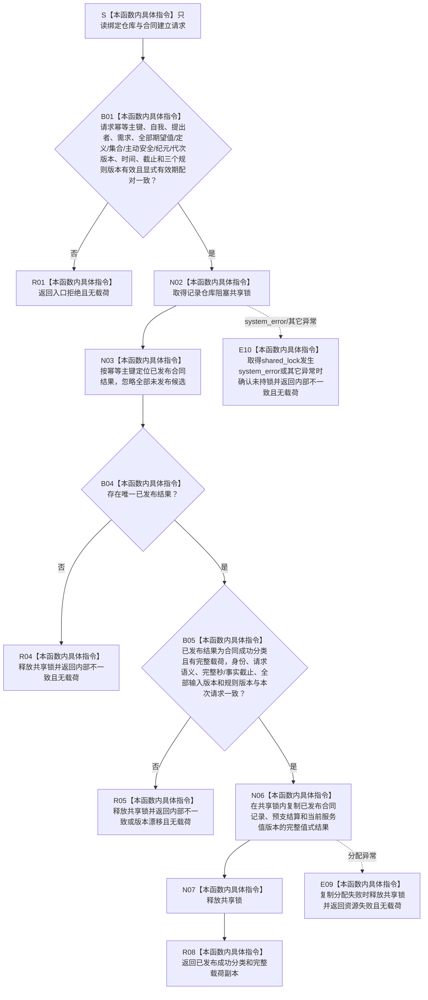

# SERVICE-P1 F-V209 `读取已发布服务合同结果` 单函数施工流程图 v0.1

图类型：目标施工流程图
状态：现行设计依据；函数待 #379 实现，不表示代码已存在
归属模块：`海中鱼巣.领域.参与者.服务生存维护记录`
归属文件：`海中鱼巣/领域/参与者.服务生存维护记录.ixx`
唯一根函数：F-V209
完整签名：

```cpp
服务合同结果 读取已发布服务合同结果(
    const 服务生存维护记录仓库& 仓库,
    const 服务合同建立请求& 请求) noexcept;
```

本函数只在阻塞共享锁内读取已经最后发布的不可变合同结果并返回值式副本；不观察参与者候选区，不创建、修补或发布记录。依据 0050、6160 与服务详细设计 v0.3 第 6.2、7.4、10 节。

## 流程图



## 节点合同

| 节点 | 类型 | 输入 | 输出 | 事实读写 |
| --- | --- | --- | --- | --- |
| B01 | 本函数内具体指令 | 请求 | 入口裁决 | 零写入 |
| N02—N07 | 本函数内具体指令 | 仓库、幂等主键 | 已发布值式副本 | 共享读取；零写入 |
| R01/R04/R05/R08/E09 | 本函数内具体指令 | 读取裁决 | `服务合同结果` | 零写入 |

## 实现约束

1. 共享锁内只允许定位、复核与复制；不得调用执行器、参与者、服务、外部提供者、日志或任何写入口。`shared_lock` 构造的 `system_error` 与其它异常必须在 `noexcept` 边界内收口为 `内部不一致`，不得终止进程。
2. 同键异义、重复已发布结果、合同与预支不原子、成功分类无载荷或字段不等均不得修补。
3. 本函数返回原始已发布成功事实；F-V211 根据执行器的 `幂等读回` 状态把对外分类映射为 `精确重复`。
