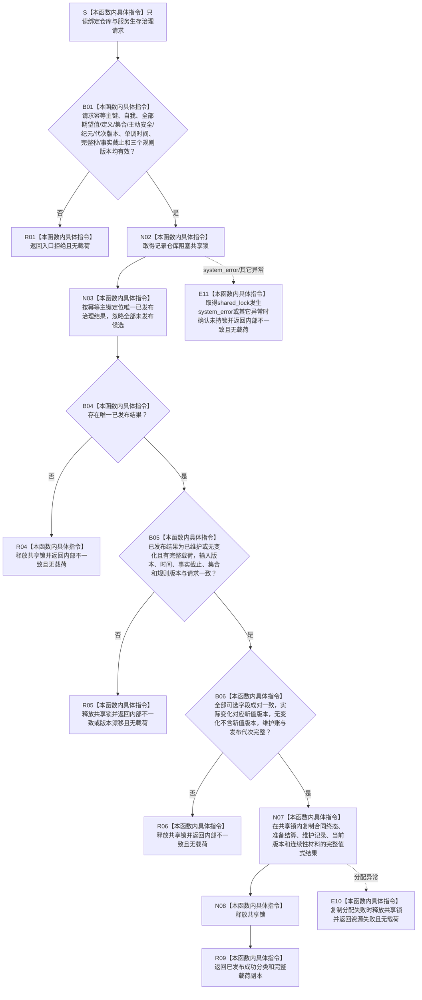

# SERVICE-P1 F-V210 `读取已发布服务生存治理结果` 单函数施工流程图 v0.1

图类型：目标施工流程图
状态：现行设计依据；函数待 #379 实现，不表示代码已存在
归属模块：`海中鱼巣.领域.参与者.服务生存维护记录`
归属文件：`海中鱼巣/领域/参与者.服务生存维护记录.ixx`
唯一根函数：F-V210
完整签名：

```cpp
服务生存治理结果 读取已发布服务生存治理结果(
    const 服务生存维护记录仓库& 仓库,
    const 服务生存治理请求& 请求) noexcept;
```

本函数只读取已经最后发布的治理结果值式副本；无变化仍必须读回维护账与当前版本，未发布候选始终不可见。依据 0050、6160、6170 与服务详细设计 v0.3 第 6.2、7.4、10 节。

## 流程图



## 节点合同

| 节点 | 类型 | 输入 | 输出 | 事实读写 |
| --- | --- | --- | --- | --- |
| B01 | 本函数内具体指令 | 治理请求 | 入口裁决 | 零写入 |
| N02—N08 | 本函数内具体指令 | 仓库、幂等主键 | 已发布值式副本 | 共享读取；零写入 |
| R01/R04—R06/R09/E10 | 本函数内具体指令 | 读取裁决 | `服务生存治理结果` | 零写入 |

## 实现约束

1. 不得在共享锁内重入执行器、参与者或任一上层服务；不得读取“最新”替代请求版本。`shared_lock` 构造的 `system_error` 与其它异常必须在 `noexcept` 边界内收口为 `内部不一致`。
2. 缺失、重复、异义、异版、半发布或载荷配对错误属于内部不一致/版本漂移，不得在读取路径确保结构存在。
3. F-V212 仅依据本函数的权威副本形成对外结果；执行器为 `幂等读回` 时由 F-V212 映射为 `精确重复`。
