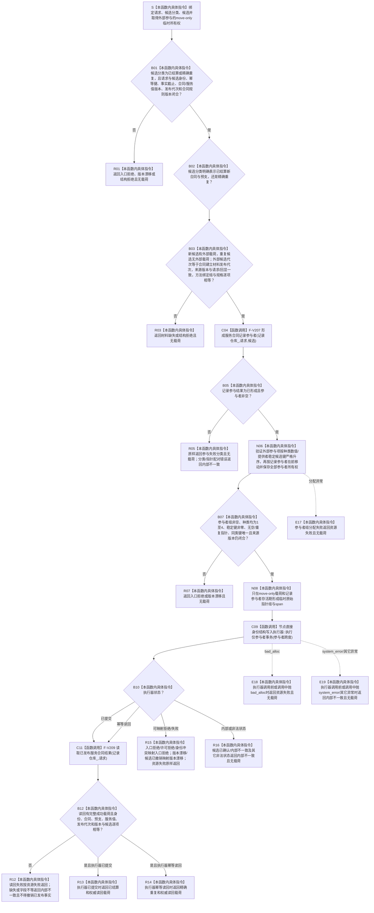

# SERVICE-P1 F-V211 `服务生存数据操作::提交服务合同候选` 单函数施工流程图 v0.1

图类型：目标施工流程图
状态：现行设计依据；函数待 #379 实现，不表示代码已存在
归属模块：`海中鱼巣.领域.数据操作.服务生存维护`
归属文件：`海中鱼巣/领域/数据操作.服务生存维护.ixx`
唯一根函数：F-V211
完整签名：

```cpp
服务合同结果 服务生存数据操作::提交服务合同候选(
    const 服务合同建立请求& 请求,
    服务生存结果分类 候选分类,
    const 服务合同载荷& 候选,
    std::optional<服务生存外部事实参与载荷>&& 外部参与) noexcept;
```

`外部参与` 是 move-only 临时所有权。新合同与 30% 预支必须携带完整外部参与；精确同义重复只携带记录参与者。函数唯一事务入口是当前真实 `节点直接身份结构写入执行器::执行仅参与者事务(std::span<节点直接身份结构写入事务参与者* const>) const`，禁止调用普通回调 `执行`。依据 0050、6160、CORE-C1/v1 与服务详细设计 v0.3 第 7.4、8、10 节。

## 流程图



## 节点合同

| 节点 | 类型 | 输入 | 输出 | 事务/生命周期 |
| --- | --- | --- | --- | --- |
| B01—B03 | 本函数内具体指令 | 请求、候选分类、候选、可选外部载荷 | 准入与参与形态 | 执行器前零写入 |
| C04 | 函数调用 | 仓库、请求、候选 | 记录参与者 | F-V207 唯一调用 |
| N06—N08 | 本函数内具体指令 | 全部 move-only 所有权 | 非空临时 span | span 不保存、不越过载荷生命周期 |
| C09 | 函数调用 | 参与者跨度 | 核心事务结果 | 唯一调用 `执行仅参与者事务` |
| C11—R14 | 函数调用/具体指令 | 已发布事务结果 | 权威合同结果 | 发布后共享读回；不得撤销 |
| R15—R16/E17 | 本函数内具体指令 | 非成功状态 | 无载荷结果 | 候选由执行器按协议撤销/隔离 |

## 实现约束

1. 本函数不得出现普通 `节点直接身份结构写入执行器::执行(回调, span)`、空回调、伪核心写集或任何第二事务入口。
2. F-V207、核心执行器与 F-V209 各至多调用一次；只有核心返回 `已提交` 或 `幂等读回` 才允许调用 F-V209。
3. 参与顺序固定为服务记录、状态、动态、关系/因果、索引；每个外部参与项显式携带稳定种类值和非零提供者稳定候选键，整个组必须已经按二元键严格升序。
4. 执行器返回前，记录参与者与外部载荷持续拥有全部对象；返回后销毁临时 span，不保存任何原始指针。
5. 成功必须来自发布后权威读回；不得直接返回算法候选或参与者准备期读回。
6. 当前真实执行器在取得独占许可或进入参与者序列前可能抛出；`bad_alloc` 映射资源失败，`system_error` 与其它异常映射内部不一致。现行发布阶段由 `noexcept` 的参与者最后发布组成，执行器不存在“真实发布后再抛出”的合法后置抛点；若实际接口新增该行为即设计漂移，禁止尝试撤销已发布事实。
