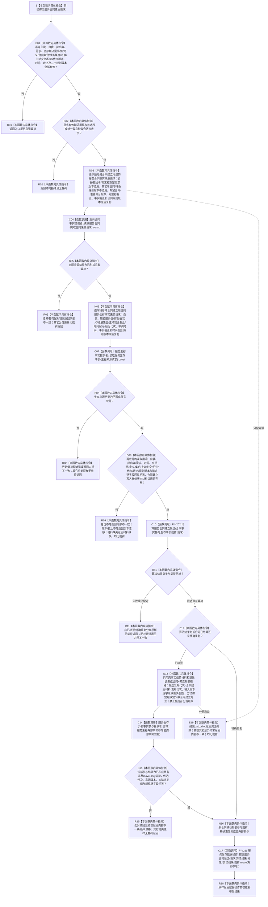

# SERVICE-P1 F-V213 `服务合同服务::建立或读取服务合同` 单函数施工流程图 v0.1

图类型：目标施工流程图
状态：现行设计依据；函数待 #379 实现，不表示代码已存在
归属模块：`海中鱼巣.领域.服务.服务合同`
归属文件：`海中鱼巣/领域/服务.服务合同.ixx`
唯一根函数：F-V213
完整签名：

```cpp
服务合同结果 服务合同服务::建立或读取服务合同(
    const 服务合同建立请求& 请求) noexcept;
```

本函数只借用构造注入的合同事实提供者、生存事实提供者、外部参与提供者和数据操作。全部首次读取条件来自公开请求；合同、结算、服务值等新身份和新版本只允许来自事实提供者返回的稳定写入身份版本材料，不得由服务、算法、仓库或执行器生成。依据 0050、6160、6170 与服务详细设计 v0.3 第 6—8、10 节。

## 流程图



## 节点合同

| 节点 | 类型 | 输入 | 输出 | 调用/事实边界 |
| --- | --- | --- | --- | --- |
| B01—N03 | 本函数内具体指令 | 公开请求 | 合同来源请求 | 全字段显式复制；零写入 |
| C04—N06 | 函数调用/具体指令 | 合同来源请求与结果 | 生存来源请求 | 合同提供者恰好一次 |
| C07—B09 | 函数调用/具体指令 | 生存来源请求与双载荷 | 闭合事实快照 | 生存提供者恰好一次 |
| C10—B12 | 函数调用/具体指令 | 双事实载荷、请求 | 值式候选 | F-V202 恰好一次 |
| N13—C15 | 具体指令/函数调用 | 新候选、提供者身份版本材料 | move-only 外部参与 | 新候选时外部提供者恰好一次 |
| N16—R18 | 具体指令/函数调用 | 候选、可选外部参与 | 发布后权威结果 | F-V211 恰好一次 |

## 实现约束

1. 两个事实提供者各调用一次；不得为补字段、重试或“刷新最新”二次读取。
2. 公开请求的每个首次读取字段必须原值进入对应来源请求，并由载荷逐字段回显；身份回显不等与版本回显不等必须分账。
3. F-V202 不得生成稳定身份/版本；新合同、结算、服务值与发布所需身份版本只取合同/生存事实载荷的写入材料。
4. 精确重复不调用外部参与提供者，但仍调用 F-V211，以记录参与者和发布后读回形成权威 `精确重复`。
5. 本函数不直接读取仓库、不持锁、不调用执行器、不返回算法临时候选。
