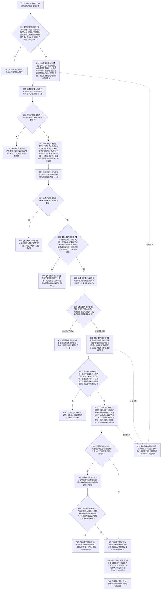

# SERVICE-P1 F-V214 `服务生存维护服务::结算服务生存治理批次` 单函数施工流程图 v0.1

图类型：目标施工流程图
状态：现行设计依据；函数待 #379 实现，不表示代码已存在
归属模块：`海中鱼巣.领域.服务.服务生存维护`
归属文件：`海中鱼巣/领域/服务.服务生存维护.ixx`
唯一根函数：F-V214
完整签名：

```cpp
服务生存治理结果 服务生存维护服务::结算服务生存治理批次(
    const 服务生存治理请求& 请求) noexcept;
```

本函数通过两个事实提供者各一次读取，冻结同一截止版本下的合同终态、准备结算、完整秒、主动安全事实、服务值和安全值，再以一个 F-V212 事务提交。全部新身份、版本和发布代次只取提供者返回的稳定写入身份版本材料。依据 0050、6160、6170 与服务详细设计 v0.3 第 6—8、10 节。

## 流程图



## 节点合同

| 节点 | 类型 | 输入 | 输出 | 调用/事实边界 |
| --- | --- | --- | --- | --- |
| B01—N02 | 本函数内具体指令 | 公开请求 | 合同来源请求 | 全部首次读取字段显式复制 |
| C03—N05 | 函数调用/具体指令 | 合同事实 | 生存来源请求 | 合同提供者恰好一次 |
| C06—B08 | 函数调用/具体指令 | 生存事实、双回显 | 闭合同秒快照 | 生存提供者恰好一次 |
| C09—B12 | 函数调用/具体指令 | 双事实载荷、请求 | 治理候选、方法绑定 | F-V203 恰好一次 |
| N13—C16 | 具体指令/函数调用 | 变化候选、身份版本材料 | 可选外部参与 | 仅有外部变化时提供者一次 |
| N17—R19 | 具体指令/函数调用 | 候选、可选外部参与 | 权威发布后结果 | F-V212 恰好一次 |

## 实现约束

1. 两个事实提供者各调用一次；不得逐合同、逐准备、逐秒或失败重试再次读取。
2. 全部身份/版本来源必须是公开请求首次读取条件或提供者返回的稳定写入材料；禁止自增版本、默认构造身份和隐式读取最新。
3. 无变化仍提交记录参与者以发布维护账；精确重复仍由 F-V212 和权威读回收口。
4. 外部参与适用性由候选实际变化唯一决定；未变化族不得伪造方法绑定，实际变化族不得缺少方法。
5. 本函数不直接持锁、写仓库、调用核心执行器或返回算法临时候选。
