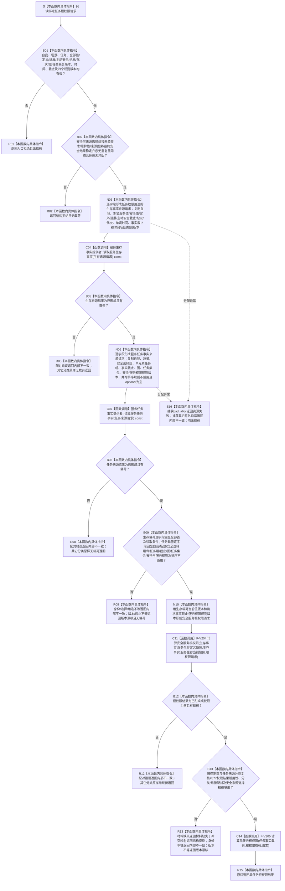

# SERVICE-P1 F-V215 `服务生存任务权限服务::计算任务根权限` 单函数施工流程图 v0.1

图类型：目标施工流程图
状态：现行设计依据；函数待 #379 实现，不表示代码已存在
归属模块：`海中鱼巣.领域.服务.服务生存任务权限`
归属文件：`海中鱼巣/领域/服务.服务生存任务权限.ixx`
唯一根函数：F-V215
完整签名：

```cpp
任务根权限结果 服务生存任务权限服务::计算任务根权限(
    const 任务根权限请求& 请求) const noexcept;
```

本函数只用公开请求显式形成一次生存事实读取和一次任务事实读取；任务提供者在内部按同一请求形成 #377 权限读取。不得枚举安全维护族、填零版本、逐来源重读或隐式读取最新。依据 6140、6150、6170 与服务详细设计 v0.3 第 5.3、6、7.2、7.5、9.4 节。

## 流程图



## 节点合同

| 节点 | 类型 | 输入 | 输出 | 调用/来源 |
| --- | --- | --- | --- | --- |
| B01—N03 | 本函数内具体指令 | 公开请求 | 生存来源请求 | 全部首次读取条件原值复制 |
| C04—N06 | 函数调用/具体指令 | 生存结果、公开请求 | 单任务来源请求 | 生存提供者恰好一次 |
| C07—B09 | 函数调用/具体指令 | 任务来源请求、双载荷 | 闭合快照 | 任务提供者恰好一次 |
| N10—C11 | 具体指令/函数调用 | 生存快照 | 根权限载荷 | F-V204 恰好一次 |
| B13—C14 | 具体指令/函数调用 | 任务事实、根权限 | 单任务结果 | F-V205 恰好一次 |

## 实现约束

1. 生存提供者与任务提供者各调用一次；不得在 F-V205 前后重读，也不得直接调用 #377 服务。
2. 任务来源请求的排序规则必须显式为“不适用 + `nullopt`”；不得填零排序版本冒充不适用。
3. 安全选择组、任务组、图版本、任务集合版本、事实截止及安全/服务权限规则版本必须逐字段回显。
4. 控制态为终止/休眠时允许 SAFETY 结果不适用；主动运行时按“全部独立服务”或“含安全来源”精确裁决适用性。
5. 不得把材料缺失任务改写为零权限成功，不得把安全兼服务来源重复计入服务权限。
