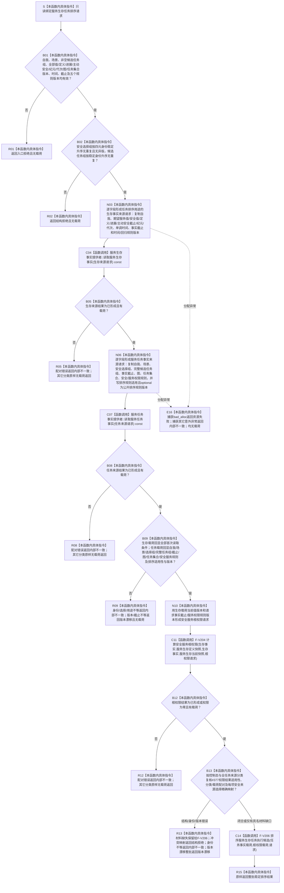

# SERVICE-P1 F-V216 `服务生存任务权限服务::排序服务生存任务候选` 单函数施工流程图 v0.1

图类型：目标施工流程图
状态：现行设计依据；函数待 #379 实现，不表示代码已存在
归属模块：`海中鱼巣.领域.服务.服务生存任务权限`
归属文件：`海中鱼巣/领域/服务.服务生存任务权限.ixx`
唯一根函数：F-V216
完整签名：

```cpp
服务生存任务排序结果 服务生存任务权限服务::排序服务生存任务候选(
    const 服务生存任务排序请求& 请求) const noexcept;
```

本函数对整批候选只读取一次生存事实和一次任务事实，再调用 F-V204 与 F-V206；禁止逐任务重读生存、任务或 SAFETY 权限。依据 6140、6150、6170 与服务详细设计 v0.3 第 5.3、6、7.2、7.5、9.4 节。

## 流程图



## 节点合同

| 节点 | 类型 | 输入 | 输出 | 调用/来源 |
| --- | --- | --- | --- | --- |
| B01—N03 | 本函数内具体指令 | 公开排序请求 | 生存来源请求 | 全部首次读取条件原值复制 |
| C04—N06 | 函数调用/具体指令 | 生存结果、公开请求 | 整批任务来源请求 | 生存提供者恰好一次 |
| C07—B09 | 函数调用/具体指令 | 任务来源请求、双载荷 | 闭合整批快照 | 任务提供者恰好一次 |
| N10—C11 | 具体指令/函数调用 | 生存快照 | 根权限载荷 | F-V204 恰好一次 |
| B13—C14 | 具体指令/函数调用 | 整批任务事实、根权限 | 稳定排序结果 | F-V206 恰好一次 |

## 实现约束

1. 两个提供者各调用一次；候选数量不得改变读取次数。
2. 排序规则必须显式为“适用 + 请求排序规则版本”；零值、默认值或 `nullopt` 都是入口错误。
3. 任务提供者返回的任务身份组必须与公开候选组顺序和值完全一致；不得补任务、删任务或改用容器当前顺序。
4. 具名材料缺口交 F-V206 分账；版本漂移、冲突映射和身份回显错误必须在排序前整批收口。
5. 最终顺序只由 F-V206 冻结键决定；服务不得按提供者返回顺序、调用到达顺序或缓存顺序追加排序。
