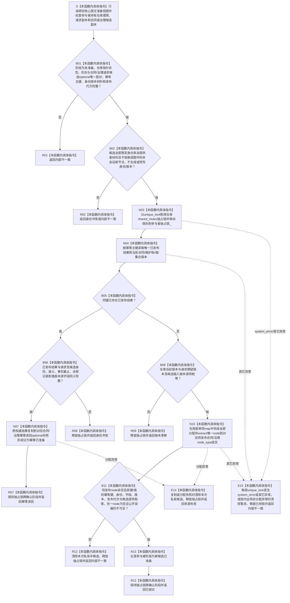

# SERVICE-P1 F-V217 `服务生存维护记录参与者::准备提交` 单函数施工流程图 v0.1

图类型：目标施工流程图
状态：现行设计依据；私有 override 待 #379 实现，不表示代码已存在
归属模块：`海中鱼巣.领域.参与者.服务生存维护记录`
归属文件：`海中鱼巣/领域/参与者.服务生存维护记录.ixx`
唯一根函数：F-V217
完整签名：

```cpp
节点直接身份结构写入结果
服务生存维护记录参与者::准备提交(
    const 节点直接身份结构提交准备只读视图& 视图) noexcept override;
```

本函数由当前真实核心执行器在取得事务域独占许可后调用。它在服务记录仓独占锁内完成幂等/冲突/版本裁决、全部可能分配、私有待发布写入和首次读回；不写公开容器，不取得核心写会话。依据 0050、6160、6170、CORE-C1/v1 与服务详细设计 v0.3 第 7.3—7.4、10 节。

## 流程图



## 节点合同

| 节点 | 类型 | 输入 | 输出 | 事实/锁边界 |
| --- | --- | --- | --- | --- |
| S—B02 | 本函数内具体指令 | 参与者私有副本、只读视图 | 阶段与身份准入 | 零写入 |
| N03—B09 | 本函数内具体指令 | 已发布仓库、请求版本 | 幂等/冲突/版本裁决 | 服务记录仓独占锁 |
| N10—B11 | 本函数内具体指令 | 完整候选 | 单一预分配 map node 及首次读回 | 公开读取不可见 |
| N12—R14 | 本函数内具体指令 | 准备裁决 | 核心写入结果 | 成功/幂等保留锁；失败释放锁 |

## 实现约束

1. 只读视图不得保存、复制或送出调用期；本函数不得请求核心会话写入。
2. 同键同义完整结果唯一返回 `幂等读回`；同键异义返回 `身份冲突`，版本不等返回 `版本漂移`。
3. F-V219 发布需要的 map node 和完整值式结果在本函数局部单项 map 中预分配并以 `extract` 存入对应 `node_type` 成员，发布阶段只能 node insertion，不得再分配。
4. `已提交` 与 `幂等读回` 返回时参与者继续持有记录仓独占锁，F-V218 不得释放；只由 F-V219 或 F-V220 正常释放。
5. 准备失败必须清除本函数产生的全部私有候选并当场释放锁；公开容器和其它参与者事实保持不变。
6. `unique_lock` 构造、已发布结果复制和局部 map 分配都位于本函数 `try` 边界内：`bad_alloc` 唯一映射资源失败，`system_error` 与其它异常映射内部不一致；任何异常都不得越过 `noexcept`。
