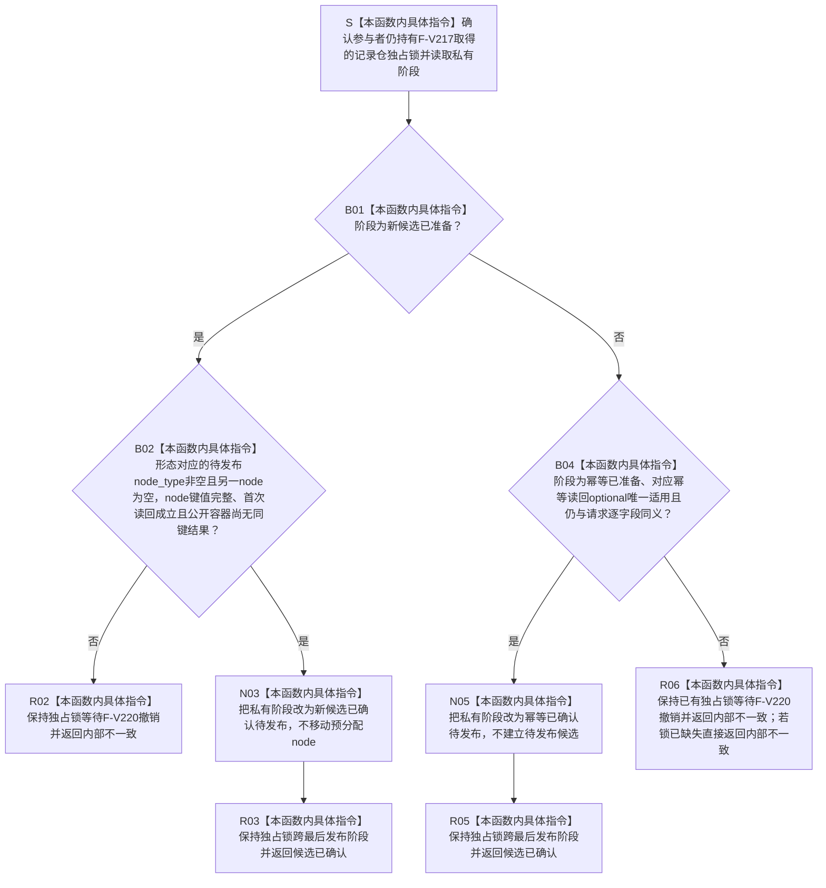

# SERVICE-P1 F-V218 `服务生存维护记录参与者::确认待发布` 单函数施工流程图 v0.1

图类型：目标施工流程图
状态：现行设计依据；私有 override 待 #379 实现，不表示代码已存在
归属模块：`海中鱼巣.领域.参与者.服务生存维护记录`
归属文件：`海中鱼巣/领域/参与者.服务生存维护记录.ixx`
唯一根函数：F-V218
完整签名：

```cpp
节点直接身份结构写入结果
服务生存维护记录参与者::确认待发布() noexcept override;
```

本函数仅允许已经准备的新候选或幂等读回参与者进入已确认阶段；不写公开容器、不分配、不发布。依据 CORE-C1/v1 与服务详细设计 v0.3 第 7.3—7.4、10 节。

## 流程图



## 节点合同

| 节点 | 类型 | 输入 | 输出 | 事实/锁边界 |
| --- | --- | --- | --- | --- |
| S—B02 | 本函数内具体指令 | 私有阶段、待发布槽 | 新候选确认裁决 | 复用 F-V217 已持有的独占锁 |
| B04—N05 | 本函数内具体指令 | 幂等阶段、权威副本 | 幂等确认裁决 | 零公开写入 |
| R02/R03/R05/R06 | 本函数内具体指令 | 阶段裁决 | 核心写入结果 | 确认成功/失败均不主动释放已有锁 |

## 实现约束

1. 唯一成功状态是 `候选已确认`，以满足当前真实仅参与者执行器的确认协议。
2. 确认不移动、不发布、不分配候选；任何公开可见性变化都只归 F-V219。
3. 重复确认、未准备确认、已撤销确认、已发布确认或半候选均返回 `内部不一致`。
4. 本函数不得重新取得、释放或转移记录仓锁；成功交给 F-V219，失败由核心转入 F-V220。
