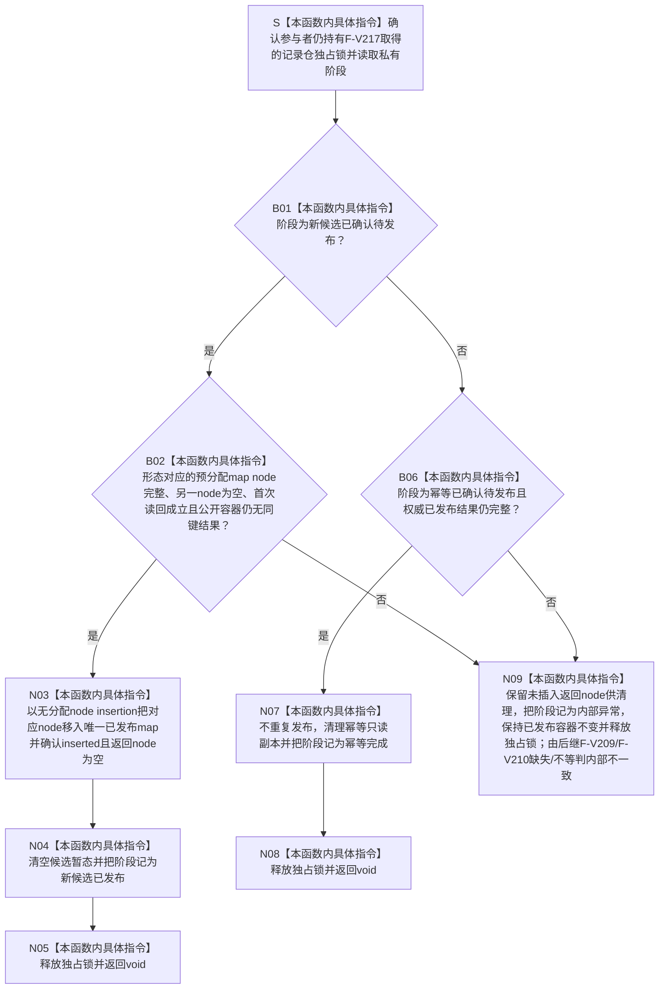

# SERVICE-P1 F-V219 `服务生存维护记录参与者::完成发布` 单函数施工流程图 v0.1

图类型：目标施工流程图
状态：现行设计依据；私有 override 待 #379 实现，不表示代码已存在
归属模块：`海中鱼巣.领域.参与者.服务生存维护记录`
归属文件：`海中鱼巣/领域/参与者.服务生存维护记录.ixx`
唯一根函数：F-V219
完整签名：

```cpp
void 服务生存维护记录参与者::完成发布() noexcept override;
```

核心执行器只在全部参与者确认成功后调用本函数。本函数不得分配或执行可能失败的业务操作；新候选只把 F-V217 已预分配、F-V218 已确认的候选原子移入公开容器，幂等候选不重复发布。依据 0050、CORE-C1/v1 与服务详细设计 v0.3 第 7.3—7.4、10 节。

## 流程图



## 节点合同

| 节点 | 类型 | 输入 | 输出 | 事实/锁边界 |
| --- | --- | --- | --- | --- |
| S—B02 | 本函数内具体指令 | 已确认私有阶段 | 发布准入 | 复用并最终释放 F-V217 已持有的独占锁 |
| N03—N05 | 本函数内具体指令 | 预分配新候选 | 唯一已发布记录 | 原子可见；无分配、无异常 |
| B06—N08 | 本函数内具体指令 | 幂等已确认状态 | 幂等完成 | 零重复写入 |
| N09 | 本函数内具体指令 | 非法阶段/半候选 | 后继读回可见的缺失/不等 | 不回删、不修补公开事实 |

## 实现约束

1. `noexcept void` 不具备失败回传通道，因此所有容量、节点和值式副本必须在 F-V217 准备阶段完成。
2. 新候选的唯一可见点是 N03；不得先发布部分记录再清理私有槽。
3. 幂等分支绝不写公开容器；已发布后不得再次移动、覆盖或增加版本。
4. F-V219 是无失败发布路径；非法阶段或读回差异只能留下可由后继 F-V209/F-V210 判定的缺失/不等结果，随后释放锁，不得抛异常、终止进程、写日志或删除已发布事实。
