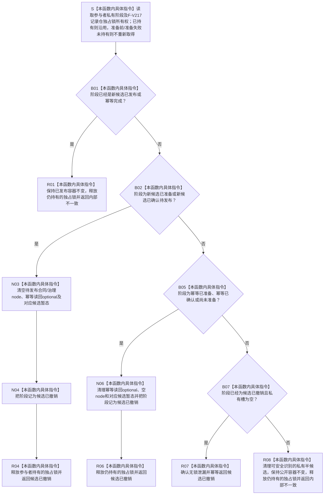

# SERVICE-P1 F-V220 `服务生存维护记录参与者::完成撤销` 单函数施工流程图 v0.1

图类型：目标施工流程图
状态：现行设计依据；私有 override 待 #379 实现，不表示代码已存在
归属模块：`海中鱼巣.领域.参与者.服务生存维护记录`
归属文件：`海中鱼巣/领域/参与者.服务生存维护记录.ixx`
唯一根函数：F-V220
完整签名：

```cpp
节点直接身份结构写入结果
服务生存维护记录参与者::完成撤销() noexcept override;
```

本函数由核心执行器在准备或确认失败后逆序调用，只清理本参与者的未发布候选和私有阶段，不回删任何已发布事实。依据 0050、CORE-C1/v1 与服务详细设计 v0.3 第 7.3—7.4、10 节。

## 流程图



## 节点合同

| 节点 | 类型 | 输入 | 输出 | 事实/锁边界 |
| --- | --- | --- | --- | --- |
| S—B02 | 本函数内具体指令 | 私有阶段、可选已持有锁 | 撤销准入 | 复用 F-V217 的锁；不重新获取 |
| N03—R04 | 本函数内具体指令 | 新候选私有槽 | 已撤销 | 零公开写入 |
| B05—R07 | 本函数内具体指令 | 幂等/空/已撤销阶段 | 幂等撤销结果 | 零公开写入 |
| R01/R08 | 本函数内具体指令 | 已发布或非法阶段 | 内部不一致 | 绝不回删已发布事实 |

## 实现约束

1. 撤销必须可重复收口；已经撤销且私有槽为空时继续返回 `候选已撤销`。
2. 已发布后调用撤销固定为 `内部不一致`，不得删除、降版或恢复公开记录。
3. 本函数是准备/确认失败后的唯一正常锁释放点；从未准备的参与者没有锁时不得为撤销重新加锁。
4. 本函数不调用外部参与者、不取得核心写会话、不写日志，不生成任何身份、版本或发布代次。
