# SERVICE-P1 F-V221 `运行服务值合同维护与生存权限专项源码自检` 单函数施工流程图 v0.1

图类型：目标施工流程图
状态：现行设计依据；专项源码函数待 #379 实现，不表示已构建或运行
归属模块：`海中鱼巣.领域.自检.服务值合同维护与生存权限`
归属文件：`海中鱼巣/领域/自检.服务值合同维护与生存权限.ixx`
唯一根函数：F-V221
完整签名：

```cpp
服务值合同维护与生存权限专项自检结果
运行服务值合同维护与生存权限专项源码自检() noexcept;
```

本函数在单一根函数体内按真实构造依赖建立局部节点仓、完整关系准入表、关系仓、索引仓、事务域、执行器、服务记录仓、隔离提供者和值式夹具，按 SS-A01—A22 固定顺序各执行一次并累计通过项。三个核心仓只作为局部空仓夹具，不接生产仓库；完整关系准入表的 24 项裁决函数指针统一指向 F-V230。不得另建非平凡夹具函数、接统一运行器、线程、日志或弹窗。需要覆盖 F-V217—F-V220 时，只能经 F-V207/F-V208 形成参与者并调用真实 `执行仅参与者事务(span)`。依据服务详细设计 v0.3 第 7.3、7.6、13 节。

## 流程图

```mermaid
flowchart TD
    S["S【本函数内具体指令】初始化结果为ABI=1、计划号=379、矩阵版本=1、总项数=22、通过项数=0，并进入根夹具构造try边界"]
    N00A["N00A【本函数内具体指令】构造非零编号节点仓；循环填满24项完整正式关系准入表：类型等于序号、授权身份非零、规则版本1、三布尔为true、裁决取F-V230函数地址"]
    N00B["N00B【本函数内具体指令】依次构造并持有有效关系仓、可重建索引仓、事务域及以四个非空地址构造的执行器；确认准入表/关系仓/执行器有效"]
    N00C["N00C【本函数内具体指令】构造局部服务记录仓、数据操作、隔离提供者和服务对象；全部局部对象活到SS-A22结束并按依赖逆序销毁"]
    E00["E00【本函数内具体指令】根夹具构造抛出或任一有效性复核失败时保持通过项数0并返回固定五字段结果；不形成半夹具"]
    N01["N01【本函数内具体指令】形成SS-A01提出者/需求/目标/范围/法规/版本逐缺失及A=0/1/>1请求组"]
    L01{"L01【本函数内具体指令】SS-A01请求组还有未执行项？"}
    C01["C01【函数调用】F-V213 服务合同服务::建立或读取服务合同(SS-A01当前隔离请求)"]
    A01["A01【本函数内具体指令】核对当前项分类/载荷/零写入，累计项内成立标记并前移游标"]
    V01["V01【本函数内具体指令】全部拒绝/准入分类、载荷和零写入符合时通过项数加1"]
    N02["N02【本函数内具体指令】形成SS-A02补充说明、拆任务、重试、同键同义与同键异义固定请求组"]
    L02{"L02【本函数内具体指令】SS-A02请求组还有未执行项？"}
    C02["C02【函数调用】F-V213 服务合同服务::建立或读取服务合同(SS-A02当前隔离请求)"]
    A02["A02【本函数内具体指令】核对当前项合同/预支数量和权威读回，累计项内成立标记并前移游标"]
    V02["V02【本函数内具体指令】只存在一份合同和一次预支且重复权威读回时通过项数加1"]
    N03["N03【本函数内具体指令】形成SS-A03显式/默认2592000秒、零/负/溢出和跨纪元材料"]
    L03{"L03【本函数内具体指令】SS-A03材料组还有未执行项？"}
    C03["C03【函数调用】F-V202 计算服务合同建立候选(SS-A03当前合同事实,生存事实,请求)"]
    A03["A03【本函数内具体指令】核对当前项有效期/时间分类，累计项内成立标记并前移游标"]
    V03["V03【本函数内具体指令】有效期与时间证据分类精确时通过项数加1"]
    N04["N04【本函数内具体指令】形成SS-A04 D0、默认预算、饱和预算和30%无溢出边界"]
    L04{"L04【本函数内具体指令】SS-A04边界组还有未执行项？"}
    C04["C04【函数调用】F-V202 计算服务合同建立候选(SS-A04当前合同事实,生存事实,请求)"]
    A04["A04【本函数内具体指令】核对当前项预算/预支/余款，累计项内成立标记并前移游标"]
    V04["V04【本函数内具体指令】预算/预支/余款精确相等且无回绕时通过项数加1"]
    N05["N05【本函数内具体指令】形成SS-A05预支、完成余款、取消和正式终止阶段材料"]
    L05{"L05【本函数内具体指令】SS-A05阶段组还有未执行项？"}
    C05["C05【函数调用】F-V203 计算服务生存治理候选(SS-A05当前合同事实,生存事实,请求)"]
    A05["A05【本函数内具体指令】核对当前项阶段/余款/预支，累计项内成立标记并前移游标"]
    V05["V05【本函数内具体指令】阶段各一次、关闭余款且不追回预支时通过项数加1"]
    N06["N06【本函数内具体指令】形成SS-A06同秒完成/取消/终止/到期及顺序歧义材料"]
    L06{"L06【本函数内具体指令】SS-A06终态组还有未执行项？"}
    C06["C06【函数调用】F-V203 计算服务生存治理候选(SS-A06当前合同事实,生存事实,请求)"]
    A06["A06【本函数内具体指令】核对当前项终态顺序/事件，累计项内成立标记并前移游标"]
    V06["V06【本函数内具体指令】终态顺序和到期未满足事件唯一且歧义拒绝时通过项数加1"]
    N07["N07【本函数内具体指令】形成SS-A07服务值上界与结算饱和舍弃材料"]
    L07{"L07【本函数内具体指令】SS-A07饱和组还有未执行项？"}
    C07["C07【函数调用】F-V202 计算服务合同建立候选(SS-A07当前合同事实,生存事实,请求)"]
    A07["A07【本函数内具体指令】核对当前项舍弃/阶段，累计项内成立标记并前移游标"]
    V07["V07【本函数内具体指令】超额舍弃、阶段完成且不可补领时通过项数加1"]
    N08["N08【本函数内具体指令】形成SS-A08准备新结果、唯一衰减段、失败与并行归属材料"]
    L08{"L08【本函数内具体指令】SS-A08准备组还有未执行项？"}
    C08["C08【函数调用】F-V203 计算服务生存治理候选(SS-A08当前合同事实,生存事实,请求)"]
    A08["A08【本函数内具体指令】核对当前项归属/重复/净增长，累计项内成立标记并前移游标"]
    V08["V08【本函数内具体指令】补回唯一、不改配、不重复且无净增长时通过项数加1"]
    N09["N09【本函数内具体指令】形成SS-A09 N=0/1/多秒、不同调用频率、跨代次有/无连续证明材料"]
    L09{"L09【本函数内具体指令】SS-A09时间组还有未执行项？"}
    C09["C09【函数调用】F-V203 计算服务生存治理候选(SS-A09当前合同事实,生存事实,请求)"]
    A09["A09【本函数内具体指令】核对当前项跨秒/连续性，累计项内成立标记并前移游标"]
    V09["V09【本函数内具体指令】批量等价、新纪元缺口发布和无法建纪元无载荷拒绝时通过项数加1"]
    N10["N10【本函数内具体指令】形成SS-A10无未满足需求且活动保护正值/零值材料"]
    L10{"L10【本函数内具体指令】SS-A10活动组还有未执行项？"}
    C10["C10【函数调用】F-V203 计算服务生存治理候选(SS-A10当前合同事实,生存事实,请求)"]
    A10["A10【本函数内具体指令】核对当前项衰减/保护，累计项内成立标记并前移游标"]
    V10["V10【本函数内具体指令】每秒减少1且活动只保护正值时通过项数加1"]
    N11["N11【本函数内具体指令】形成SS-A11多个未满足需求和t=0/T-1等待材料"]
    L11{"L11【本函数内具体指令】SS-A11等待组还有未执行项？"}
    C11["C11【函数调用】F-V203 计算服务生存治理候选(SS-A11当前合同事实,生存事实,请求)"]
    A11["A11【本函数内具体指令】核对当前项最长等待/地板和，累计项内成立标记并前移游标"]
    V11["V11【本函数内具体指令】最长等待唯一、多需求不叠加且地板和精确时通过项数加1"]
    N12["N12【本函数内具体指令】形成SS-A12 t=T/T+1、到期事件、活动最低1与活动解除材料"]
    L12{"L12【本函数内具体指令】SS-A12门禁组还有未执行项？"}
    C12["C12【函数调用】F-V203 计算服务生存治理候选(SS-A12当前合同事实,生存事实,请求)"]
    A12["A12【本函数内具体指令】核对当前项归零/保护/解除，累计项内成立标记并前移游标"]
    V12["V12【本函数内具体指令】30天归零/保护/解除分类精确时通过项数加1"]
    N13["N13【本函数内具体指令】形成SS-A13多分段键、地板和、跳跃证明与前后值材料"]
    L13{"L13【本函数内具体指令】SS-A13分段组还有未执行项？"}
    C13["C13【函数调用】F-V203 计算服务生存治理候选(SS-A13当前合同事实,生存事实,请求)"]
    A13["A13【本函数内具体指令】核对当前项分段/跳跃证明，累计项内成立标记并前移游标"]
    V13["V13【本函数内具体指令】分段记录完整且批量等价逐秒时通过项数加1"]
    N14["N14【本函数内具体指令】形成SS-A14定义版本和V=0/1/U-1/U/I64_MAX比例边界"]
    L14{"L14【本函数内具体指令】SS-A14比例组还有未执行项？"}
    C14A["C14A【函数调用】F-V201 复核服务生存定义(SS-A14当前定义)"]
    C14B["C14B【函数调用】F-V203 计算服务生存治理候选(SS-A14当前合同事实,生存事实,请求)"]
    A14["A14【本函数内具体指令】核对当前项定义/比例，累计项内成立标记并前移游标"]
    V14["V14【本函数内具体指令】定义合法且服务比例严格位于1至99时通过项数加1"]
    N15["N15【本函数内具体指令】形成SS-A15 A=0/1/L-1/L/H/H+1/I64_MAX及主动安全优先材料"]
    L15{"L15【本函数内具体指令】SS-A15安全根组还有未执行项？"}
    C15["C15【函数调用】F-V204 计算安全服务根权限(SS-A15当前定义,当前,请求)"]
    A15["A15【本函数内具体指令】核对当前项控制态/根权限，累计项内成立标记并前移游标"]
    V15["V15【本函数内具体指令】控制态、两根权限和主动安全优先边界精确时通过项数加1"]
    N16["N16【本函数内具体指令】形成SS-A16低/中/高区间、先除100、最小1与封顶封底材料"]
    L16{"L16【本函数内具体指令】SS-A16回归组还有未执行项？"}
    C16["C16【函数调用】F-V203 计算服务生存治理候选(SS-A16当前合同事实,生存事实,请求)"]
    A16["A16【本函数内具体指令】核对当前项回归值/边界，累计项内成立标记并前移游标"]
    V16["V16【本函数内具体指令】安全回归步长及闭区间保持精确时通过项数加1"]
    N17["N17【本函数内具体指令】形成SS-A17 A=0/1及三个主动运行阈值区间和单任务材料"]
    L17{"L17【本函数内具体指令】SS-A17权限组还有未执行项？"}
    C17A["C17A【函数调用】F-V204 计算安全服务根权限(SS-A17当前定义,当前,请求)"]
    C17B["C17B【函数调用】F-V215 服务生存任务权限服务::计算任务根权限(SS-A17当前公开请求) const"]
    A17["A17【本函数内具体指令】核对当前项控制态/任务权限，累计项内成立标记并前移游标"]
    V17["V17【本函数内具体指令】零权限/最小入口白名单及100/0、1/99根权限精确时通过项数加1"]
    N18["N18【本函数内具体指令】形成SS-A18安全、独立服务、安全兼服务及并列多来源任务组"]
    L18{"L18【本函数内具体指令】SS-A18来源组还有未执行项？"}
    C18A["C18A【函数调用】F-V205 计算单任务根权限(SS-A18当前任务事实,根权限,单任务请求)"]
    C18B["C18B【函数调用】F-V206 排序服务生存任务执行候选(SS-A18当前任务事实,根权限,排序请求)"]
    C18C["C18C【函数调用】F-V216 服务生存任务权限服务::排序服务生存任务候选(SS-A18当前公开请求) const"]
    A18["A18【本函数内具体指令】核对当前项三类来源/排序，累计项内成立标记并前移游标"]
    V18["V18【本函数内具体指令】安全组合、独立服务、安全兼服务不重复且稳定排序时通过项数加1"]
    N19["N19【本函数内具体指令】形成SS-A19合同与治理候选，复用根函数局部真实核心事务域/执行器，形成外部参与者和准备/确认故障注入材料"]
    L19{"L19【本函数内具体指令】SS-A19事务/故障组还有未执行项？"}
    C19A["C19A【函数调用】F-V207 形成服务合同记录参与者(隔离记录仓,当前合同请求,合同候选)"]
    C19B["C19B【函数调用】F-V208 形成服务生存治理记录参与者(隔离记录仓,治理请求,治理候选)"]
    C19C["C19C【函数调用】节点直接身份结构写入执行器::执行仅参与者事务(隔离参与者跨度)"]
    C19D["C19D【函数调用】F-V211 服务生存数据操作::提交服务合同候选(请求,候选分类,候选,move(外部参与))"]
    C19E["C19E【函数调用】F-V212 服务生存数据操作::提交服务生存治理候选(请求,候选分类,候选,move(外部参与))"]
    A19["A19【本函数内具体指令】核对当前事务脚本阶段/撤销/顺序/方法，累计项内成立标记并前移游标"]
    V19["V19【本函数内具体指令】F-V217准备、F-V218确认、F-V219发布、失败时F-V220逆序撤销、固定顺序和唯一方法来源全部成立时通过项数加1"]
    N20["N20【本函数内具体指令】形成SS-A20两份固定新候选、仅通过F-V211/F-V212发布到局部记录仓，再形成合同/治理阻塞读回请求；不宣称恢复"]
    C20P["C20P【函数调用】F-V211 服务生存数据操作::提交服务合同候选(合同请求,已结算,候选,move(外部参与))"]
    C20Q["C20Q【函数调用】F-V212 服务生存数据操作::提交服务生存治理候选(治理请求,已维护,候选,move(外部参与))"]
    C20A["C20A【函数调用】F-V209 读取已发布服务合同结果(隔离记录仓,合同请求)"]
    C20B["C20B【函数调用】F-V210 读取已发布服务生存治理结果(隔离记录仓,治理请求)"]
    V20["V20【本函数内具体指令】两次已发布阻塞读回与候选逐字段相等、重复读回无变化时通过项数加1"]
    N21["N21【本函数内具体指令】形成SS-A21 A=1合同预支、后续完整秒维护和普通任务发布前读取材料"]
    L21{"L21【本函数内具体指令】SS-A21两阶段脚本还有未执行项？"}
    C21A["C21A【函数调用】F-V213 服务合同服务::建立或读取服务合同(SS-A21当前合同请求)"]
    C21B["C21B【函数调用】F-V214 服务生存维护服务::结算服务生存治理批次(SS-A21当前治理请求)"]
    A21["A21【本函数内具体指令】核对当前阶段预支/后续完整秒/禁派发，累计项内成立标记并前移游标"]
    V21["V21【本函数内具体指令】预支使V为正、后续合法秒使A大于1且发布前普通任务不可派发时通过项数加1"]
    N22["N22【本函数内具体指令】复制SS-A22输入的#377权限值式载荷和局部记录仓已发布计数，调用F-V205/F-V206后再次复制；线程/调度/日志/import边界由计划静态命令验证"]
    C22A["C22A【函数调用】F-V205 计算单任务根权限(SS-A22任务事实,根权限,单任务请求)"]
    C22B["C22B【函数调用】F-V206 排序服务生存任务执行候选(SS-A22任务事实,根权限,排序请求)"]
    V22["V22【本函数内具体指令】前后#377载荷及局部仓计数逐字段相等且两调用零写入时通过项数加1"]
    R["R【本函数内具体指令】返回固定五字段专项自检结果"]
    S --> N00A --> N00B --> N00C --> N01 --> L01
    N00A -. "异常/不完整" .-> E00
    N00B -. "异常/无效" .-> E00
    N00C -. "异常" .-> E00
    E00 --> R
    L01 -- "是" --> C01 --> A01 --> L01
    L01 -- "否" --> V01 --> N02 --> L02
    L02 -- "是" --> C02 --> A02 --> L02
    L02 -- "否" --> V02 --> N03 --> L03
    L03 -- "是" --> C03 --> A03 --> L03
    L03 -- "否" --> V03 --> N04 --> L04
    L04 -- "是" --> C04 --> A04 --> L04
    L04 -- "否" --> V04 --> N05 --> L05
    L05 -- "是" --> C05 --> A05 --> L05
    L05 -- "否" --> V05 --> N06 --> L06
    L06 -- "是" --> C06 --> A06 --> L06
    L06 -- "否" --> V06 --> N07 --> L07
    L07 -- "是" --> C07 --> A07 --> L07
    L07 -- "否" --> V07 --> N08 --> L08
    L08 -- "是" --> C08 --> A08 --> L08
    L08 -- "否" --> V08 --> N09 --> L09
    L09 -- "是" --> C09 --> A09 --> L09
    L09 -- "否" --> V09 --> N10 --> L10
    L10 -- "是" --> C10 --> A10 --> L10
    L10 -- "否" --> V10 --> N11 --> L11
    L11 -- "是" --> C11 --> A11 --> L11
    L11 -- "否" --> V11 --> N12 --> L12
    L12 -- "是" --> C12 --> A12 --> L12
    L12 -- "否" --> V12 --> N13 --> L13
    L13 -- "是" --> C13 --> A13 --> L13
    L13 -- "否" --> V13 --> N14 --> L14
    L14 -- "是" --> C14A --> C14B --> A14 --> L14
    L14 -- "否" --> V14 --> N15 --> L15
    L15 -- "是" --> C15 --> A15 --> L15
    L15 -- "否" --> V15 --> N16 --> L16
    L16 -- "是" --> C16 --> A16 --> L16
    L16 -- "否" --> V16 --> N17 --> L17
    L17 -- "是" --> C17A --> C17B --> A17 --> L17
    L17 -- "否" --> V17 --> N18 --> L18
    L18 -- "是" --> C18A --> C18B --> C18C --> A18 --> L18
    L18 -- "否" --> V18 --> N19 --> L19
    L19 -- "是" --> C19A --> C19B --> C19C --> C19D --> C19E --> A19 --> L19
    L19 -- "否" --> V19 --> N20 --> C20P --> C20Q --> C20A --> C20B --> V20 --> N21 --> L21
    L21 -- "是" --> C21A --> C21B --> A21 --> L21
    L21 -- "否" --> V21 --> N22 --> C22A --> C22B --> V22 --> R
```



## SS-A01—A22 节点合同

| 编号 | 主要调用根 | 固定证明 |
| --- | --- | --- |
| SS-A01 | F-V213 | 合同逐字段准入；A=0 拒绝，A=1/>1 继续 |
| SS-A02 | F-V213、F-V211/F-V209 间接读回 | 唯一合同与同义幂等 |
| SS-A03 | F-V202 | 显式/默认有效期及跨纪元缺口 |
| SS-A04 | F-V202 | D0、预算饱和、30% 无溢出 |
| SS-A05 | F-V203 | 预支/余款唯一阶段与终止不追缴 |
| SS-A06 | F-V203 | 同秒终态顺序与到期事件唯一 |
| SS-A07 | F-V202 | 饱和舍弃且不得补领 |
| SS-A08 | F-V203 | 准备衰减唯一归属和无净增长 |
| SS-A09 | F-V203 | N=0/1/多秒、批量等价和时间证据 |
| SS-A10 | F-V203 | 无需求每秒 1 与正值活动保护 |
| SS-A11 | F-V203 | 最长等待唯一、多需求不叠加 |
| SS-A12 | F-V203 | 30 天归零、活动最低 1 与解除 |
| SS-A13 | F-V203 | 分段键、地板和、跳跃证明可审计 |
| SS-A14 | F-V201、F-V203 | 定义与服务比例 1..99 |
| SS-A15 | F-V204 | 安全根边界和主动事实优先 |
| SS-A16 | F-V203 | 安全回归顺序、最小步长和阈值 |
| SS-A17 | F-V204、F-V215 | 控制态、根权限和最小入口 |
| SS-A18 | F-V205、F-V206、F-V216 | 三类来源组合与稳定排序 |
| SS-A19 | F-V207、F-V208、F-V211、F-V212、真实仅参与者执行器 | F-V217—F-V220 阶段、原子性、撤销与动作来源 |
| SS-A20 | F-V211、F-V212、F-V209、F-V210 | 局部真实发布后合同 / 治理记录阻塞读回；恢复属于 #359 |
| SS-A21 | F-V213、F-V214 | 休眠预支、后续秒唤醒与发布前禁派发 |
| SS-A22 | F-V205、F-V206 | #377 权限值式载荷和局部仓计数前后不变；线程 / 调度 / 日志 / import 边界由计划静态验证 |

## 实现约束

1. SS-A01—A22 必须按编号升序各执行一次；任何单项异常只影响该项，不提前返回，也不把异常写日志。
2. 局部提供者只按预装值式结果返回并记录调用次数/最后请求；不得创建真实机器事实或非平凡辅助根函数。
3. F-V217—F-V220 为私有 override，自检不得直接调用；只能让真实核心执行器经 F-V207/F-V208 形成的参与者触达。
4. 每项结束后销毁其局部候选和 move-only 所有权；不得跨项共享未发布状态、锁、span 或原始指针。
5. 返回值只含合同 ABI、计划编号、矩阵版本、总项数和通过项数；源码存在或全项通过都不等于构建、运行、真实适配或生产能力完成。
6. N01—N19、N21 形成的是非空有序用例表；对应 L/C/A 节点必须对每一项逐次调用并累计项内成立标记，只有游标到达表尾且全部项成立才允许该 SS 项加一。禁止把多边界请求组压成一次函数调用。
7. 三核心仓、事务域和执行器必须是 F-V221 的局部自动对象：节点仓编号和关系仓编号固定非零且不相等；关系准入表按 `正式关系类型ABI数量 == 24` 全量填写并调用 `完整()` 复核；关系仓调用 `有效()`，执行器调用 `有效()`；构造顺序固定为节点仓、关系准入表、关系仓、索引仓、事务域、执行器。不得传空指针、默认无效准入表、借用外部仓库或新增夹具聚合函数。
