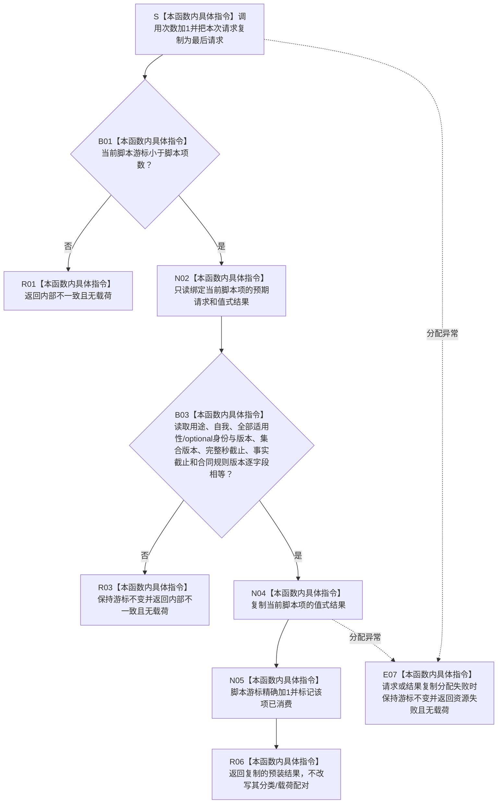

# SERVICE-P1 F-V222 `隔离服务合同事实提供者::读取服务合同事实` 单函数施工流程图 v0.1

图类型：目标施工流程图
状态：现行自检设计依据；函数待 #379 实现，不表示源码自检已运行
归属模块：`海中鱼巣.领域.自检.服务值合同维护与生存权限`
归属文件：`海中鱼巣/领域/自检.服务值合同维护与生存权限.ixx`
唯一根函数：F-V222
完整签名：

```cpp
服务合同事实来源结果
隔离服务合同事实提供者::读取服务合同事实(
    const 服务合同事实来源请求& 请求) const noexcept override;
```

提供者持有按调用序号排列的“预期请求 + 值式结果”预装脚本、mutable 游标、调用次数和最后请求。只有当前请求逐字段等于当前脚本项才复制结果并前移；错序、请求不等或脚本耗尽返回 `内部不一致`，不前移脚本。依据服务详细设计 v0.3 第 7.3、7.6 节。

## 流程图



## 节点合同

| 节点 | 类型 | 输入 | 输出 | 状态变化 |
| --- | --- | --- | --- | --- |
| S—B03 | 本函数内具体指令 | 请求、当前脚本项 | 严格匹配裁决 | 调用计数/最后请求；脚本未消费 |
| N04—R06 | 本函数内具体指令 | 预装结果 | 值式结果副本 | 仅匹配成功后游标前移一次 |
| R01/R03/E07 | 本函数内具体指令 | 耗尽、错请求或分配失败 | 无载荷失败 | 游标不变 |

## 实现约束

1. `const` 只表示接口只读；脚本游标、调用次数和最后请求为隔离自检 mutable 观测材料，不是机器事实。
2. 禁止模糊匹配、忽略 optional 配对、跳项搜索、循环复用最后结果或读取最新。
3. 预装结果允许故意包含服务侧要识别的拒绝/坏配对，不得由提供者修正。
