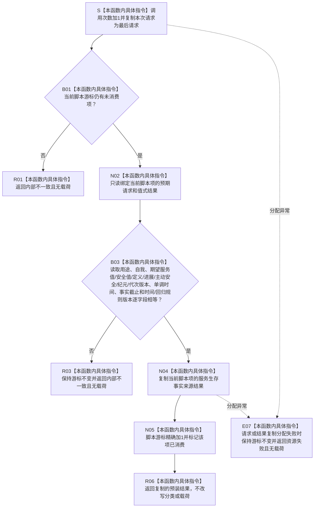

# SERVICE-P1 F-V223 `隔离服务生存事实提供者::读取服务生存事实` 单函数施工流程图 v0.1

图类型：目标施工流程图
状态：现行自检设计依据；函数待 #379 实现，不表示源码自检已运行
归属模块：`海中鱼巣.领域.自检.服务值合同维护与生存权限`
归属文件：`海中鱼巣/领域/自检.服务值合同维护与生存权限.ixx`
唯一根函数：F-V223
完整签名：

```cpp
服务生存事实来源结果
隔离服务生存事实提供者::读取服务生存事实(
    const 服务生存事实来源请求& 请求) const noexcept override;
```

本函数严格消费按调用序号预装的生存事实脚本；不读取时钟、仓库或缓存，不用当前值替代请求的首次读取条件。依据服务详细设计 v0.3 第 7.2、7.6 节。

## 流程图



## 节点合同

| 节点 | 类型 | 输入 | 输出 | 状态变化 |
| --- | --- | --- | --- | --- |
| S—B03 | 本函数内具体指令 | 生存来源请求、脚本项 | 全字段匹配裁决 | 调用观测更新；游标未前移 |
| N04—R06 | 本函数内具体指令 | 预装值式结果 | 结果副本 | 匹配成功后恰好消费一项 |
| R01/R03/E07 | 本函数内具体指令 | 耗尽、错请求或资源失败 | 无载荷失败 | 游标不变 |

## 实现约束

1. 当前单调时间和全部版本必须按位/按值精确比较；不得使用范围匹配或“相近时间”。
2. `bad_alloc` 只映射资源失败，不消费脚本；其它异常映射内部不一致且不越过 `noexcept`。
3. 本函数零机器事实读写，只产生隔离调用证据。
