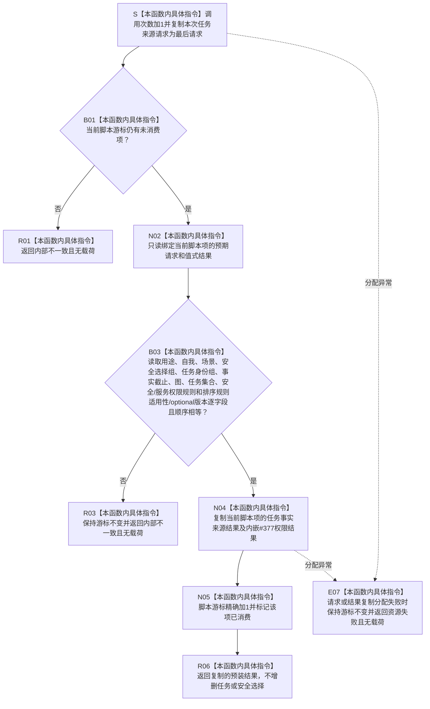

# SERVICE-P1 F-V224 `隔离服务任务事实提供者::读取服务任务事实` 单函数施工流程图 v0.1

图类型：目标施工流程图
状态：现行自检设计依据；函数待 #379 实现，不表示源码自检已运行
归属模块：`海中鱼巣.领域.自检.服务值合同维护与生存权限`
归属文件：`海中鱼巣/领域/自检.服务值合同维护与生存权限.ixx`
唯一根函数：F-V224
完整签名：

```cpp
服务任务事实来源结果
隔离服务任务事实提供者::读取服务任务事实(
    const 服务任务事实来源请求& 请求) const noexcept override;
```

本函数严格核对任务权限/排序请求脚本，尤其保留安全层来源选择组、任务组、图与任务集合版本、安全/服务权限规则和排序规则适用性。依据 6140、6150 与服务详细设计 v0.3 第 7.2、7.6 节。

## 流程图



## 节点合同

| 节点 | 类型 | 输入 | 输出 | 状态变化 |
| --- | --- | --- | --- | --- |
| S—B03 | 本函数内具体指令 | 任务来源请求、脚本项 | 精确匹配裁决 | 调用观测更新；游标未前移 |
| N04—R06 | 本函数内具体指令 | 预装任务/Safety结果 | 值式结果副本 | 匹配成功后消费一项 |
| R01/R03/E07 | 本函数内具体指令 | 耗尽、错序、错请求、资源失败 | 无载荷失败 | 游标不变 |

## 实现约束

1. vector 顺序属于请求合同；不得排序后再比较、集合化比较或忽略同四元身份异版。
2. 排序不适用必须严格匹配“不适用 + `nullopt`”，排序适用必须严格匹配“适用 + 具名版本”。
3. 提供者不直接调用 #377、不枚举维护族、不修正脚本中的材料缺失或版本漂移结果。
