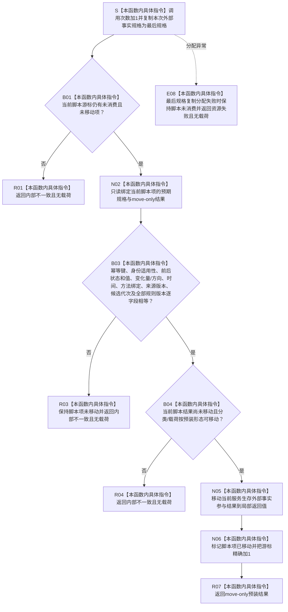

# SERVICE-P1 F-V225 `隔离服务生存外部事实参与提供者::形成服务生存外部事实参与包` 单函数施工流程图 v0.1

图类型：目标施工流程图
状态：现行自检设计依据；函数待 #379 实现，不表示源码自检已运行
归属模块：`海中鱼巣.领域.自检.服务值合同维护与生存权限`
归属文件：`海中鱼巣/领域/自检.服务值合同维护与生存权限.ixx`
唯一根函数：F-V225
完整签名：

```cpp
服务生存外部事实参与结果
隔离服务生存外部事实参与提供者::形成服务生存外部事实参与包(
    const 服务生存外部事实规格& 规格) noexcept override;
```

提供者持有“预期规格 + move-only 参与结果”脚本。匹配成功时当前结果只能移动一次并前移；脚本耗尽、错序、规格不等或重复取得返回 `内部不一致`。它只构造 F-V226—F-V229 隔离参与者，不写任何真实机器事实。依据服务详细设计 v0.3 第 7.2、7.6 节。

## 流程图



## 节点合同

| 节点 | 类型 | 输入 | 输出 | 所有权变化 |
| --- | --- | --- | --- | --- |
| S—B04 | 本函数内具体指令 | 外部规格、当前脚本项 | 严格匹配/一次性裁决 | 脚本结果仍归提供者 |
| N05—R07 | 本函数内具体指令 | move-only 结果 | 外部参与结果 | 所有权移出且恰好消费一次 |
| R01/R03/R04/E08 | 本函数内具体指令 | 耗尽、错规格、重取或资源失败 | 无载荷失败 | 结果不移动 |

## 实现约束

1. 规格中的方法绑定组和所有有序组按原顺序比较；不得排序、补齐或忽略未发生变化族。
2. 脚本项构造阶段可预装多个 F-V226—F-V229 隔离参与者；本函数只移动所有权，不调用其私有阶段函数。
3. 返回后提供者不得保存参与者裸指针或再次提供同一结果。
