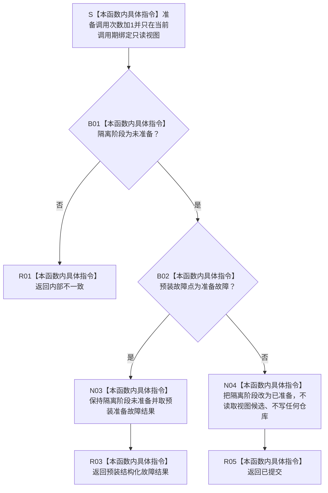

# SERVICE-P1 F-V226 `隔离外部事实参与者::准备提交` 单函数施工流程图 v0.1

图类型：目标施工流程图
状态：现行自检设计依据；私有 override 待 #379 实现，不表示源码自检已运行
归属模块：`海中鱼巣.领域.自检.服务值合同维护与生存权限`
归属文件：`海中鱼巣/领域/自检.服务值合同维护与生存权限.ixx`
唯一根函数：F-V226
完整签名：

```cpp
节点直接身份结构写入结果
隔离外部事实参与者::准备提交(
    const 节点直接身份结构提交准备只读视图& 视图) noexcept override;
```

本函数只维护隔离阶段、准备调用计数和预装准备故障，不读取或写入服务记录仓、核心仓及任何机器事实，也不保存核心只读视图。依据 CORE-C1/v1 与服务详细设计 v0.3 第 7.3、7.6 节。

## 流程图



## 节点合同

| 节点 | 类型 | 输入 | 输出 | 隔离状态 |
| --- | --- | --- | --- | --- |
| S—B02 | 本函数内具体指令 | 调用期只读视图、阶段、故障点 | 准备裁决 | 仅调用计数变化 |
| N03—R03 | 本函数内具体指令 | 预装故障结果 | 结构化失败 | 阶段保持未准备 |
| N04—R05 | 本函数内具体指令 | 无故障 | `已提交` | 阶段变为已准备 |

## 实现约束

1. 不得调用只读视图的候选读取来制造业务证据；不得保存视图地址或引用。
2. 调用计数、阶段和故障点只是自检内存观测，不得发布为项目事实。
3. 函数内不得分配、抛异常或调用其它项目函数。
