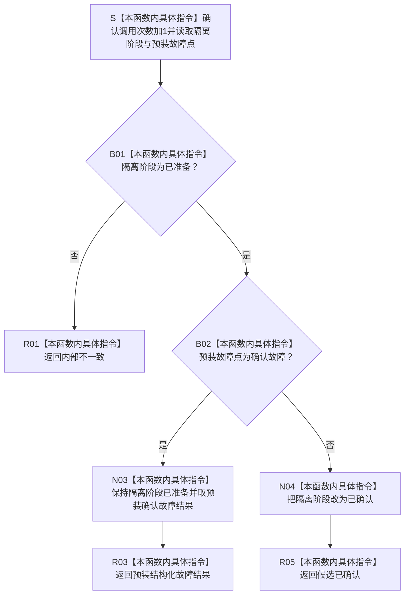

# SERVICE-P1 F-V227 `隔离外部事实参与者::确认待发布` 单函数施工流程图 v0.1

图类型：目标施工流程图
状态：现行自检设计依据；私有 override 待 #379 实现，不表示源码自检已运行
归属模块：`海中鱼巣.领域.自检.服务值合同维护与生存权限`
归属文件：`海中鱼巣/领域/自检.服务值合同维护与生存权限.ixx`
唯一根函数：F-V227
完整签名：

```cpp
节点直接身份结构写入结果
隔离外部事实参与者::确认待发布() noexcept override;
```

本函数只把正常的隔离已准备阶段推进为已确认，或返回预装确认故障；零仓库和机器事实读写。依据 CORE-C1/v1 与服务详细设计 v0.3 第 7.3、7.6 节。

## 流程图



## 节点合同

| 节点 | 类型 | 输入 | 输出 | 隔离状态 |
| --- | --- | --- | --- | --- |
| S—B02 | 本函数内具体指令 | 已准备阶段、故障点 | 确认裁决 | 确认计数加1 |
| N03—R03 | 本函数内具体指令 | 预装确认故障 | 结构化失败 | 保持已准备供 F-V229 撤销 |
| N04—R05 | 本函数内具体指令 | 正常确认 | `候选已确认` | 阶段变为已确认 |

## 实现约束

1. 确认成功必须精确返回当前核心协议要求的 `候选已确认`。
2. 不得发布、撤销、访问仓库或调用 F-V228/F-V229。
3. 重复确认、未准备、已发布或已撤销统一返回内部不一致。
