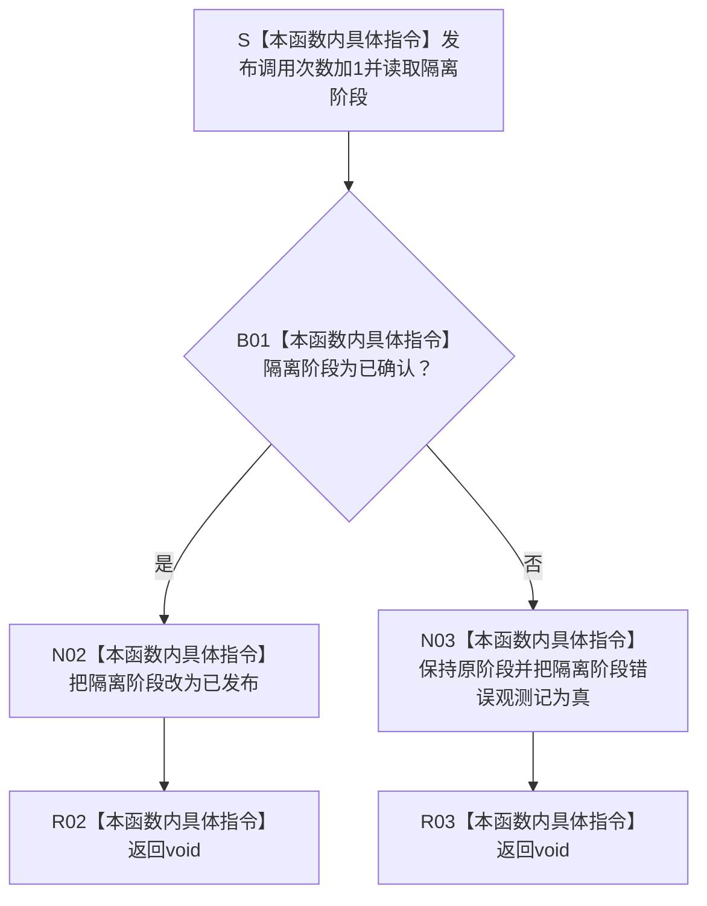

# SERVICE-P1 F-V228 `隔离外部事实参与者::完成发布` 单函数施工流程图 v0.1

图类型：目标施工流程图
状态：现行自检设计依据；私有 override 待 #379 实现，不表示源码自检已运行
归属模块：`海中鱼巣.领域.自检.服务值合同维护与生存权限`
归属文件：`海中鱼巣/领域/自检.服务值合同维护与生存权限.ixx`
唯一根函数：F-V228
完整签名：

```cpp
void 隔离外部事实参与者::完成发布() noexcept override;
```

本函数只记录发布调用次数并把隔离已确认阶段改为已发布；不发布任何机器事实。核心执行器仅在全部参与者确认成功后调用。依据 CORE-C1/v1 与服务详细设计 v0.3 第 7.3、7.6 节。

## 流程图



## 节点合同

| 节点 | 类型 | 输入 | 输出 | 隔离状态 |
| --- | --- | --- | --- | --- |
| S—B01 | 本函数内具体指令 | 当前阶段 | 发布准入 | 发布计数加1 |
| N02—R02 | 本函数内具体指令 | 已确认 | `void` | 阶段变为已发布 |
| N03—R03 | 本函数内具体指令 | 非法阶段 | `void` | 只记隔离错误观测 |

## 实现约束

1. 不得分配、抛异常、写仓库、发布节点/关系/索引或调用日志。
2. “已发布”只是一项局部自检阶段标志，用于证明核心调用顺序，不取得机器事实身份。
3. 非法阶段因接口为 `noexcept void` 只记隔离观测，由 F-V221 判该项不通过。
