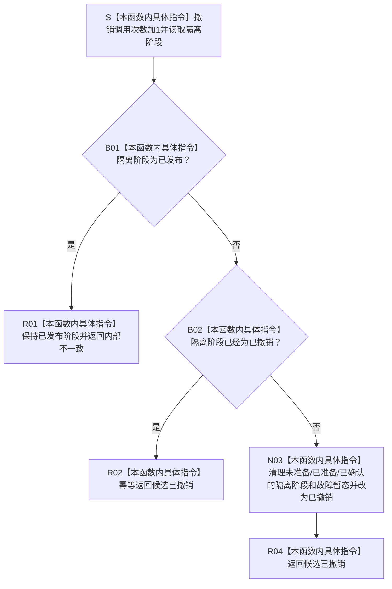

# SERVICE-P1 F-V229 `隔离外部事实参与者::完成撤销` 单函数施工流程图 v0.1

图类型：目标施工流程图
状态：现行自检设计依据；私有 override 待 #379 实现，不表示源码自检已运行
归属模块：`海中鱼巣.领域.自检.服务值合同维护与生存权限`
归属文件：`海中鱼巣/领域/自检.服务值合同维护与生存权限.ixx`
唯一根函数：F-V229
完整签名：

```cpp
节点直接身份结构写入结果
隔离外部事实参与者::完成撤销() noexcept override;
```

本函数在核心失败收口中清理未发布隔离阶段并返回 `候选已撤销`；已发布后撤销固定为内部不一致。它不撤销或修改任何真实机器事实。依据 CORE-C1/v1 与服务详细设计 v0.3 第 7.3、7.6 节。

## 流程图



## 节点合同

| 节点 | 类型 | 输入 | 输出 | 隔离状态 |
| --- | --- | --- | --- | --- |
| S—B02 | 本函数内具体指令 | 当前阶段 | 撤销裁决 | 撤销计数加1 |
| N03—R04 | 本函数内具体指令 | 任一未发布阶段 | `候选已撤销` | 阶段变为已撤销 |
| R01/R02 | 本函数内具体指令 | 已发布/已撤销 | 内部不一致或幂等撤销 | 不改真实事实 |

## 实现约束

1. 已发布后不得伪撤销；重复撤销可以幂等返回 `候选已撤销`。
2. 撤销只清理隔离成员状态，不访问服务记录仓或核心仓。
3. 函数不得分配、抛异常、调用其它项目函数或写日志。
