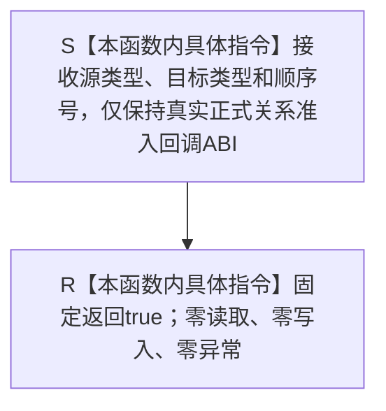

# SERVICE-P1 F-V230 `允许服务生存专项隔离关系` 单函数施工流程图 v0.1

图类型：目标施工流程图
状态：现行设计依据；隔离准入函数待 #379 实现，不表示已构建或运行
归属模块：`海中鱼巣.领域.自检.服务值合同维护与生存权限`
归属文件：`海中鱼巣/领域/自检.服务值合同维护与生存权限.ixx`
唯一根函数：F-V230
完整签名：

```cpp
bool 允许服务生存专项隔离关系(
    节点类型 源类型,
    节点类型 目标类型,
    std::int64_t 顺序号) noexcept;
```

本函数只为 F-V221 的局部 `完整正式关系准入表` 提供具名、稳定且满足真实 `正式关系角色准入函数` ABI 的非空函数指针。专项只调用 `执行仅参与者事务(span)`，不会建立节点、关系或索引候选；因此三个参数只用于满足真实回调 ABI，本函数固定返回 `true`，不得读取参数、仓库、时钟或任何机器事实。依据服务详细设计 v0.3 第 7.3、7.6、13 节。

## 流程图



## 节点合同

| 节点 | 类型 | 输入 | 输出 | 事实边界 |
| --- | --- | --- | --- | --- |
| S | 本函数内具体指令 | 三个 ABI 参数 | 无 | 不读取参数含义，不持有借用 |
| R | 本函数内具体指令 | 无 | `true` | 零仓库、关系、索引、时钟、日志和异常 |

## 实现约束

1. 不得改成 lambda、函数对象、模板或跨模块前置声明；F-V230 是专项模块唯一的具名关系准入回调。
2. 不得根据节点类型或顺序号形成业务准入语义；它只服务局部隔离空核心仓夹具，不得导出给生产模块。
3. 不得调用其它函数、分配资源、抛异常或读写任何机器事实。
