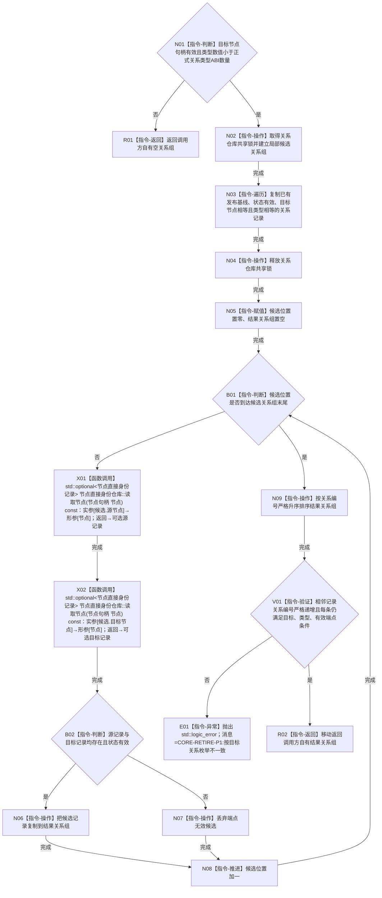

# CR-F01 读取指向有效关系组单函数施工流程图

版本：v0.1
创建侧代码基线：`57866ac5ca63235ed12da60f635d29f1aacd718b`
根函数：`正式关系仓库::读取指向有效关系组`
完整签名：`std::vector<正式关系记录> 正式关系仓库::读取指向有效关系组(节点句柄 目标节点, 关系类型 类型) const`
归属模块 / 文件：`海中鱼巣.核心.仓库.正式关系` / `海中鱼巣/核心/仓库.正式关系.ixx`；待新增公开成员。
参数与所有权：`目标节点`、`类型` 均按值传入；函数只借用仓库及节点仓，不泄露锁或内部引用。
返回与所有权：返回独立 `std::vector<正式关系记录>` 副本，由调用方独占；空组是合法结果。
非法值与错误：无效目标句柄或 `类型` 数值不在 `0..正式关系类型ABI数量-1` 时返回空组、零写入；`std::bad_alloc/std::length_error` 原样传播；后置不变量破坏抛 `std::logic_error`。事务外由 CR-F56 映射为结构化内部不一致，事务内由写执行器撤销收口。
结果语义：只返回普通视图中已发布、有效、目标和类型相等且两个端点在锁外普通读取仍有效的记录；按 `关系编号` 严格升序。

节点合同：N02—N04 是唯一关系仓锁区；X01、X02 必须在释放关系锁后调用，禁止跨仓同时持锁。N03 只复制已发布基线，候选写后不得进入普通视图。V01 是前置成立后的内部一致性门，失败不得降级为空组。

双向引用：

- 上游业务节点：`B03—B05`，见 [关系反向读取与节点退役事务业务流程图](./20260730_CORE-RETIRE-P1_关系反向读取与节点退役事务业务流程图_v0.1.md)。
- 直接调用方：CR-F04 的同事务读取以本函数谓词为普通视图基准，见 [CR-F04](./20260730_CORE-RETIRE-P1_CR-F04_会话读取指向有效关系组单函数施工流程图_v0.1.md)。
- 直接被调方：`节点直接身份仓库::读取节点(节点句柄)`；当前包不修改该现有函数。
