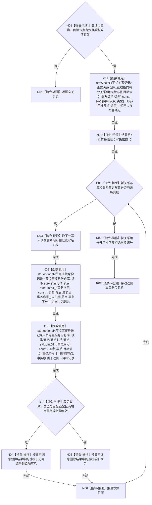

# CR-F04 会话读取指向有效关系组单函数施工流程图

版本：v0.1
创建侧代码基线：`57866ac5ca63235ed12da60f635d29f1aacd718b`

## 函数合同

```text
根函数：节点直接身份结构写入会话::读取指向有效关系组
归属：海中鱼巣.核心.会话.节点直接身份结构写入 / 海中鱼巣/核心/会话.节点直接身份结构写入.ixx
现有或待新增：待新增公开成员
完整签名：std::vector<正式关系记录> 节点直接身份结构写入会话::读取指向有效关系组(节点句柄 目标节点, 关系类型 类型)
参数：目标节点、类型均值传入；无效句柄、未知类型或不可查询会话返回空组
返回：调用方独占的本事务值式关系组；空组合法；关系编号严格升序
所有权：会话借用三仓且独占自身写集；不外泄仓库引用、锁、许可或候选
结果语义：以 CR-F01 普通发布基线为起点，叠加本会话新关系写集与关系变更写集；创建/重挂只见写后，失效不命中
```



节点边界：本函数的枚举查询不改变任何候选的“已读回”状态；精确候选读回只由会话 `读取关系` / `读取关系审计` 完成。X01 反向引用 [CR-F01](./20260730_CORE-RETIRE-P1_CR-F01_读取指向有效关系组单函数施工流程图_v0.1.md)；X02/X03 使用节点仓事务读取。不存在关系仓事务枚举重载。
