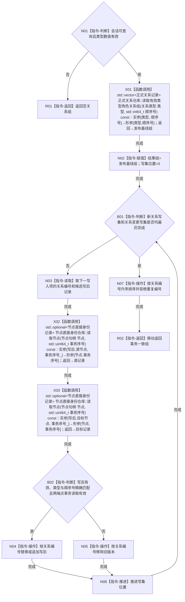

# CR-F06 会话读取有效类型角色关系组单函数施工流程图

版本：v0.1
创建侧代码基线：`57866ac5ca63235ed12da60f635d29f1aacd718b`

## 函数合同

```text
根函数：节点直接身份结构写入会话::读取有效类型角色关系组
归属：海中鱼巣.核心.会话.节点直接身份结构写入 / 海中鱼巣/核心/会话.节点直接身份结构写入.ixx
现有或待新增：待新增公开成员
完整签名：std::vector<正式关系记录> 节点直接身份结构写入会话::读取有效类型角色关系组(关系类型 类型, std::int64_t 顺序号)
参数：类型、顺序号值传入；顺序号允许全部 I64；未知类型或不可查询会话返回空组
返回：调用方独占的事务一致值式组，按关系编号升序；空组合法
所有权：会话独占写集；仓库、锁、许可和候选均不逸出
结果语义：CR-F03 发布基线叠加两类本会话写集；核心层只作类型和顺序号精确比较
```



节点边界：查询不标记候选已读回；X01 反向引用 [CR-F03](./20260730_CORE-RETIRE-P1_CR-F03_读取有效类型角色关系组单函数施工流程图_v0.1.md)。不存在关系仓事务枚举重载。
