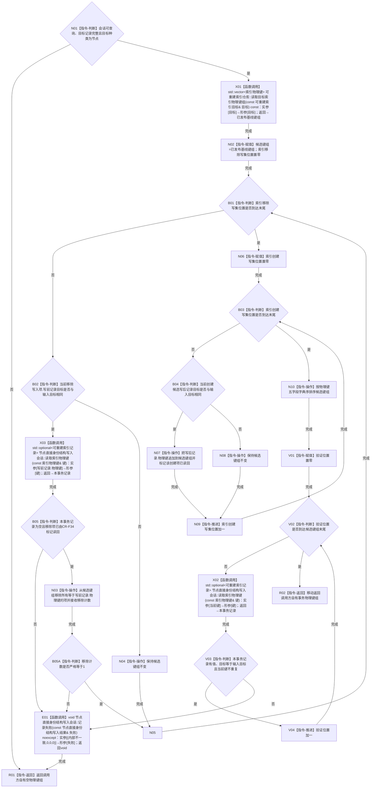

# CR-F07 会话读取目标索引物理键组单函数施工流程图

版本：v0.1
创建侧代码基线：`57866ac5ca63235ed12da60f635d29f1aacd718b`
根函数：`节点直接身份结构写入会话::读取目标索引物理键组`
完整签名：`std::vector<索引物理键> 节点直接身份结构写入会话::读取目标索引物理键组(const 可重建索引目标& 目标)`
归属模块 / 文件：`海中鱼巣.核心.会话.节点直接身份结构写入` / `海中鱼巣/核心/会话.节点直接身份结构写入.ixx`；待新增公开成员。
参数与所有权：`目标` 仅在调用期借用且不保存；会话写集由当前事务独占。
返回与所有权：返回调用方独占的 `索引物理键` 副本组；空组合法。
非法值与错误：会话不可查询、`可重建索引目标完整(目标)==false` 或 `目标.目标种类 != 索引目标种类::节点` 时返回空组；本包不放行关系索引。正反绑定错配、重复物理键、移除写集缺写前记录或同一键创建与移除并存是内部不一致，记录首次失败且不返回半结果。
结果语义：从本事务视图返回仍指向同一节点目标的键；本事务移除键不命中、创建键命中；按 `(所有者身份, 命名域, 键格式版本, 探测规则版本, 键值)` 严格升序。

节点合同：本包目标身份只允许 `索引目标种类::节点`、一个有效节点句柄和一个无效关系句柄共同形成；声明中的 `关系=2` 不取得新增、移除或恢复权限。X01 只取得普通已发布基线，不存在事务反向读取重载。N03 先移除、N07 后纳入；X02 逐键调用 CR-F34 读取本事务视图并同时标记对应创建/移除写入项已读回，V03 禁止同键在创建和移除写集中并存。

双向引用：

- 上游业务节点：`B10—B11/B14`，见 [关系反向读取与节点退役事务业务流程图](./20260730_CORE-RETIRE-P1_关系反向读取与节点退役事务业务流程图_v0.1.md)。
- 直接调用方：`CR-F12 节点直接身份结构写入会话::删除节点候选(节点句柄)`；其删除前必须证明目标索引键均已进入本事务移除写集。
- 直接被调方：CR-F30 `可重建索引仓库::读取目标索引物理键组(const 可重建索引目标&) const`、CR-F34 `节点直接身份结构写入会话::读取索引物理键(const 索引物理键&)`、`可重建索引目标完整`、会话私有 `记录失败`。
