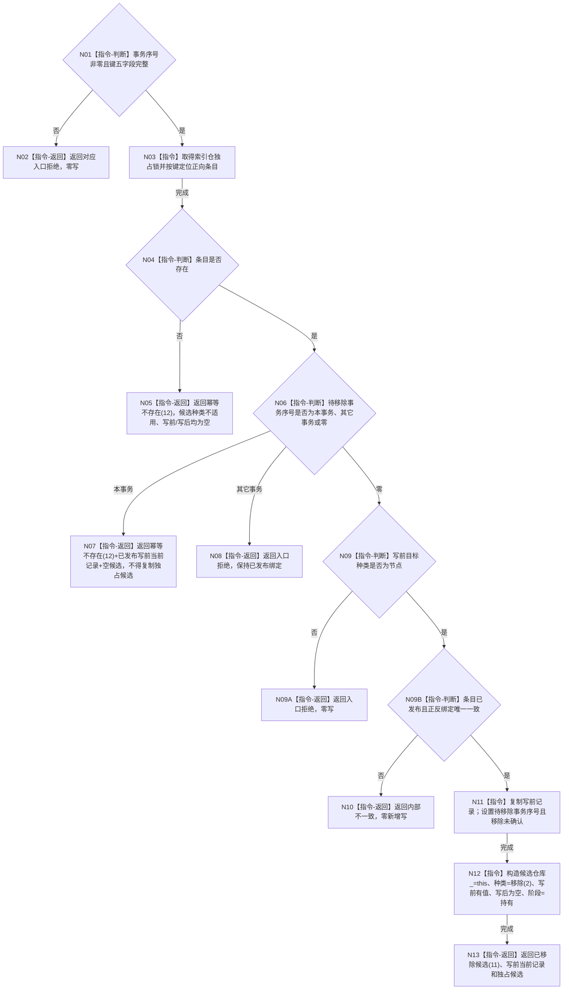

# CR-F08 结构化移除索引候选单函数施工流程图

日期：2026-07-30
版本：v0.1
代码基线：`57866ac5ca63235ed12da60f635d29f1aacd718b`

## 依据与身份

- 业务上游：`流程图/20260730_CORE-RETIRE-P1_关系反向读取与节点退役事务业务流程图_v0.1.md` B10—B11。
- 函数确认：`规范/详细设计/20260730_CORE-RETIRE-P1_函数功能确认_v0.1.md` CR-F08。
- 节点分析：`规范/详细设计/20260730_CORE-RETIRE-P1_逐函数逐节点实现分析_v0.1.md` CR-F08。
- 详细设计：`规范/详细设计/20260730_CORE-RETIRE-P1_关系反向读取与核心节点退役事务详细设计_v0.1.md` §4.2、§5、§7。
- 本图是待实现目标函数的正式施工图，不证明代码已实现。

## 函数合同

```text
根函数：结构化移除索引候选
归属：海中鱼巣.核心.仓库.可重建索引 / 核心/仓库.可重建索引.ixx / 仓库层公开成员
完整签名：可重建索引写入结果 可重建索引仓库::结构化移除索引候选(const 索引物理键& 键, std::uint64_t 事务序号)
参数：
- 键：const 索引物理键&，只借用到函数返回；五字段必须完整；调用方保有所有权。
- 事务序号：std::uint64_t，值传入；必须非零且由事务域独占许可产生。
返回：可重建索引写入结果，值归调用方。
- 已移除候选(11)：当前记录为写前记录，候选为“写前有值、写后为空”的可移动独占候选。
- 幂等不存在(12)：不形成新候选。物理键不存在时 `当前记录` 为空；同事务已经持有待移除候选时 `当前记录` 回显已发布写前记录，由会话据此读回原写集。
- 入口拒绝：事务零、键不完整、其它事务候选或绑定不匹配。
- 内部不一致：前置通过后正反绑定不唯一或不一致。
所有权/生命周期：候选离开返回值后由调用方移入会话写集；仓库锁仅在本函数内持有。
```

调用者：CR-F13 `节点直接身份结构写入会话::移除索引候选`，见 `流程图/20260730_CORE-RETIRE-P1_CR-F13_会话移除索引候选单函数施工流程图_v0.1.md`。
被调复杂项目函数：无；完整性、比较和目标标识均为平凡函数，不另建图。

## 流程图



## 节点合同与边界

| 节点 | 事实读写 | 完成/失败条件 | 验证 |
| --- | --- | --- | --- |
| N01—N02 | 不读仓、不写仓 | 非法输入不得取得候选 | T18 |
| N03—N10 | 读取正向条目、写前目标种类、反向组及待移除标记 | 普通不存在为幂等；非节点目标/并发候选拒绝；错配为内部不一致 | T19—T22 |
| N11—N13 | 只写候选标记，不删除正反绑定 | 普通读取仍命中；本事务读取过滤该键 | T23—T24 |

关键边界：形成候选不物理删除索引；不调用节点仓或关系仓；不得持索引锁调用日志、I/O、回调或其它仓库。CR-F09、CR-F10、CR-F11 分别确认、撤销和发布本候选，并反向引用本图。
