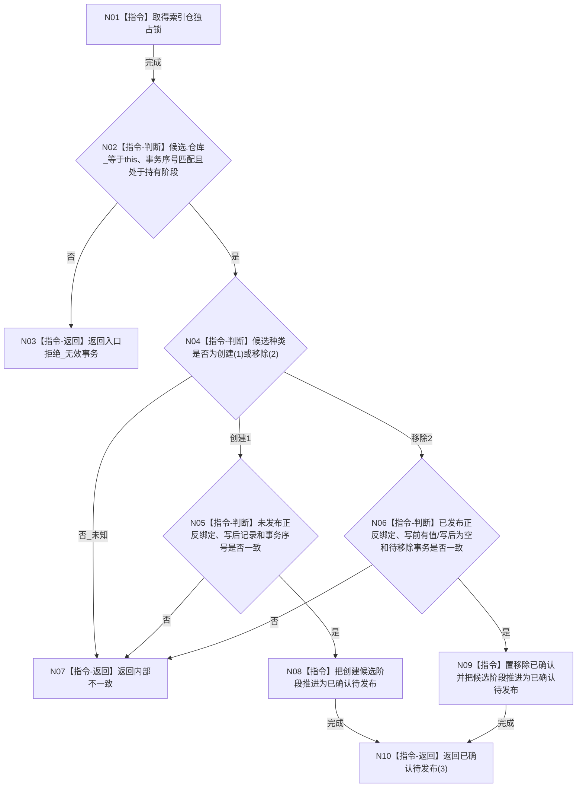

# CR-F09 确认索引候选单函数施工流程图

日期：2026-07-30
版本：v0.1
代码基线：`57866ac5ca63235ed12da60f635d29f1aacd718b`

## 依据与身份

依据：业务图 B11—B15；函数功能确认 CR-F09；逐节点分析 CR-F09；详细设计 §4.2、§5、§7。
本图是待实现目标函数的正式施工图，不证明代码已实现。

## 函数合同

```text
根函数：确认候选
归属：海中鱼巣.核心.仓库.可重建索引 / 核心/仓库.可重建索引.ixx / 仓库层公开成员
完整签名：可重建索引操作状态 可重建索引仓库::确认候选(可重建索引候选& 候选, std::uint64_t 事务序号)
参数：
- 候选：可重建索引候选&，调用方独占且函数借用；必须归属本仓、本事务并处于持有阶段。
- 事务序号：std::uint64_t，值传入，必须非零且等于候选事务序号。
返回：可重建索引操作状态；成功仅为已确认待发布(3)；无异常跨边界。
结果语义：创建候选证明未发布正反绑定存在；移除候选证明已发布正反绑定与写前记录一致；确认不改变普通/事务可见性。
```

调用者：CR-F14，见 `流程图/20260730_CORE-RETIRE-P1_CR-F14_会话完成确认单函数施工流程图_v0.1.md`。
候选提供者：CR-F08（移除），见 `流程图/20260730_CORE-RETIRE-P1_CR-F08_结构化移除索引候选单函数施工流程图_v0.1.md`；创建候选沿现有入口形成。

## 流程图



## 节点合同与边界

| 节点 | 事实读写 | 后继条件 | 验证 |
| --- | --- | --- | --- |
| N01—N03 | 只读候选身份/阶段 | 错事务、错阶段逻辑内拒绝 | T23、T35 |
| N04—N07 | 互证候选种类对应的正反绑定 | 前置成立后的结构错配为内部不一致 | T24—T25 |
| N08—N10 | 只推进确认标记和候选阶段 | 零物理发布、零可见性变化 | T25、T35—T39 |

确认后完整撤销材料必须仍在候选中；发布前普通读取仍观察事务前态。后继 CR-F10/CR-F11 分别撤销/发布，并通过本候选阶段反向约束本函数。
