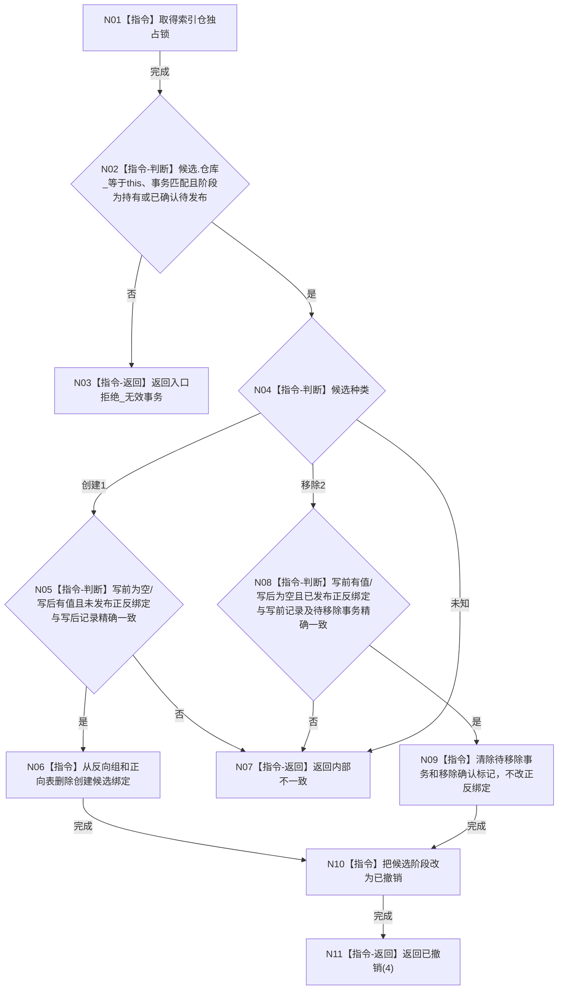

# CR-F10 撤销索引候选单函数施工流程图

日期：2026-07-30
版本：v0.1
代码基线：`57866ac5ca63235ed12da60f635d29f1aacd718b`

## 依据与身份

依据：业务图 B11—B15；函数功能确认 CR-F10；逐节点分析 CR-F10；详细设计 §4.2、§5、§7。
本图是待实现目标函数的正式施工图。

## 函数合同

```text
根函数：撤销候选
归属：海中鱼巣.核心.仓库.可重建索引 / 核心/仓库.可重建索引.ixx / 仓库层公开成员
完整签名：可重建索引操作状态 可重建索引仓库::撤销候选(可重建索引候选& 候选, std::uint64_t 事务序号)
参数：
- 候选：可重建索引候选&，调用方独占；允许持有或已确认待发布阶段。
- 事务序号：std::uint64_t，值传入；非零且匹配候选。
返回：可重建索引操作状态；成功为已撤销(4)；归属/阶段错误为入口拒绝；结构前态错配为内部不一致。
后置：创建候选删除未发布正反绑定；移除候选保留已发布正反绑定并清除移除标记；两者都恢复写前普通读取。
```

调用者：CR-F13 的局部资源失败补偿，以及 CR-F15 的统一逆序撤销；CR-F15 图由同包其它所有者建立。
候选来源：CR-F08，见 `流程图/20260730_CORE-RETIRE-P1_CR-F08_结构化移除索引候选单函数施工流程图_v0.1.md`。

## 流程图



## 节点合同与边界

| 节点 | 事实读写 | 完成条件 | 验证 |
| --- | --- | --- | --- |
| N01—N04 | 读取候选归属、阶段、种类 | 只接受可撤销阶段 | T25、T36—T43 |
| N05—N07 | 创建分支删除候选产生的两向绑定 | 恢复创建前不存在 | 现有创建候选回归 |
| N08—N11 | 移除分支仅清候选标记 | 已发布索引继续可读，恢复移除前态 | T26、T40—T43 |

本函数不得吞掉正反错配；不得重建默认记录；不得调用其它仓库。调用者必须在统一撤销中继续尝试其它候选并在任一失败时把事务域隔离。
