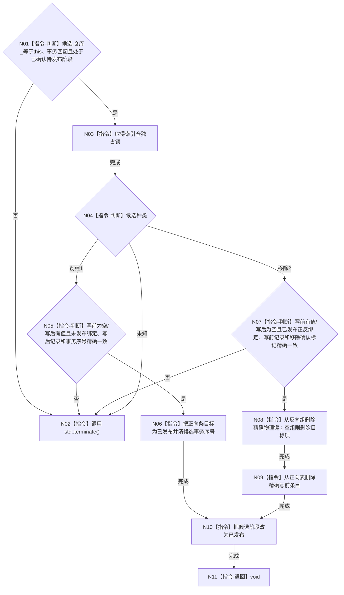

# CR-F11 完成发布索引候选单函数施工流程图

日期：2026-07-30
版本：v0.1
代码基线：`57866ac5ca63235ed12da60f635d29f1aacd718b`

## 依据与身份

依据：业务图 B11—B15；函数功能确认 CR-F11；逐节点分析 CR-F11；详细设计 §4.2、§5、§7。
本图是待实现目标函数的正式施工图。

## 函数合同

```text
根函数：完成发布
归属：海中鱼巣.核心.仓库.可重建索引 / 核心/仓库.可重建索引.ixx / 仓库层公开成员
完整签名：void 可重建索引仓库::完成发布(可重建索引候选& 候选, std::uint64_t 事务序号) noexcept
参数：
- 候选：可重建索引候选&，会话写集独占；必须已确认待发布。
- 事务序号：std::uint64_t，值传入；必须非零且匹配候选。
返回：void；成功关闭候选。任何前态不匹配立即 std::terminate()，不得返回可继续运行的半发布结构。
资源：noexcept 无失败区内不得分配。
后置：创建候选发布绑定；移除候选按精确写前记录物理删除正反绑定；候选阶段改为已发布。
```

调用者：`节点直接身份结构写入会话::完成发布()`；该函数在 CR-F14 全确认后按关系→索引→节点删除顺序调用本函数。
候选前置：CR-F09，见 `流程图/20260730_CORE-RETIRE-P1_CR-F09_确认索引候选单函数施工流程图_v0.1.md`。

## 流程图



## 节点合同与边界

| 节点 | 事实读写 | 不变量 | 验证 |
| --- | --- | --- | --- |
| N01—N03 | 只读确认前态并取得本仓锁 | 不匹配即终止 | T25、T35—T39 |
| N04—N06 | 创建分支一次发布 | 正反绑定不改变，只改变可见状态 | 创建生命周期回归 |
| N07—N11 | 移除分支物理删除两向绑定 | 反向先删、正向后删；全过程不分配 | T27、T44—T45 |

本函数只可在全部候选已经确认后进入；不提供逻辑内失败结果，不允许静默 `return`。发布后普通正向和反向读取均不得命中已移除键。
