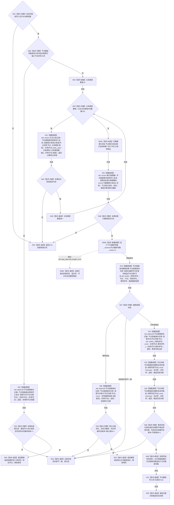

# CR-F12 会话删除节点候选单函数施工流程图

日期：2026-07-30
版本：v0.1
创建侧代码基线：`57866ac5ca63235ed12da60f635d29f1aacd718b`

## 身份与函数合同

本图是待实现目标函数的正式施工图，不证明代码已实现。

```text
根函数：节点直接身份结构写入会话::删除节点候选
归属模块 / 文件 / 层级：海中鱼巣.核心.会话.节点直接身份结构写入 / 海中鱼巣/核心/会话.节点直接身份结构写入.ixx / 会话编排层公开成员
完整签名：节点直接身份带值结构写入结果<节点句柄> 节点直接身份结构写入会话::删除节点候选(节点句柄 节点)
参数：节点，节点句柄，值传入；必须为本节点仓完整当前有效句柄，调用方不转移所有权
返回：带值结果归调用方；已提交携带同仓同编号、版本+1的删除写后句柄；同事务重复从既有节点删除写集回显同一写后句柄；节点已经正式删除时幂等读回仓库审计证明的已删除身份；拒绝/失败无值
非法值：会话不可写、句柄不完整、关系事务视图或节点目标索引事务视图非空、版本上限、候选材料错配
所有权/生命周期：局部候选在成功登记后唯一移入节点删除写集；仓库内部持锁，会话不持仓库锁
```

## 双向引用

- 调用者：[CR-F57](./20260730_CORE-RETIRE-P1_CR-F57_登记核心节点退役候选单函数施工流程图_v0.1.md) 及具名低层专项夹具。
- 被调图：CR-F05 会话读取相关有效关系组、CR-F07 会话读取目标索引物理键组。
- 被调现有函数：`节点直接身份仓库::结构化删除节点未发布候选`、`节点直接身份仓库::读取节点(节点句柄,std::uint64_t) const`、`节点直接身份仓库::读取节点审计(节点句柄) const`、候选 `读取写前节点()/读取写后节点()`、`节点直接身份仓库::撤销节点删除候选`。
- CR-F14、CR-F15、CR-F37 分别确认、撤销、发布本函数登记的节点删除写集。

## 流程图



## 节点合同与关键边界

| 节点 | 事实读写 | 完成/失败条件 | 验证 |
| --- | --- | --- | --- |
| N01—N06 | 只读全部类型关系事务视图；以 `可重建索引目标{索引目标种类::节点, 节点, {}}` 读取节点目标索引事务视图 | 两者均为空才允许形成删除候选；不伪造索引物理键或完整索引记录 | 关系/索引残留分别拒绝 |
| B00—R00 | 读取既有节点删除写集并通过 CR-F55 完成精确读回 | 同事务重复只回显同一写后节点，不形成第二候选 | 精确重复幂等 |
| X03—N08 | 形成删除候选并以事务写前记录和候选写前/写后句柄互证 | 同仓同编号、版本严格+1 | 错配拒绝 |
| X08—R02 | 普通审计仓库幂等回显 | 只有已经正式删除且版本严格+1才是无写幂等；孤立待删除标记为内部不一致 | 已发布重复 |
| N06A/N09—R05 | 候选形成前预留，形成后无分配转移并标记已读回 | 预留失败时仓库尚无候选；不遗留孤立候选 | 统一确认/撤销门禁 |

发布前禁止用删除写后句柄调用仓库普通 `读取节点`；写后句柄标识待发布的已删除身份，不是普通可读节点记录。同事务重复只从会话写集回显；仓库返回幂等但会话无写集时必须以普通审计证明已经正式删除，否则属于内部不一致。带必需领域记录的节点不属于本包可退役对象。
关系残留复核必须机械遍历数值 `0..23`，上界唯一取当前 `正式关系类型ABI数量=24`；不得手写遗漏某一具名类型，也不得把未知数值传入关系仓。
